# PIC – Workflow Diagrams

AlphaHelion Purchasing Intelligence Cloud. Flow diagrams of every workflow implemented in the platform, module by module, with the life cycle (state diagram) of each main document.

Date: 10 November 2026. Code baseline: `main` at commit `d111aca` (database migration head 0028). Written for: the client's process owners, key users and the implementation team.

This document is the picture view. The full rules, checks, events and KPIs behind each box are in the PIC Workflow Guide (`docs/PIC_Workflow_Guide.md`), same module numbers. Newer decisions are in `docs/PIC_Default_Decisions.md` (invoice approval bands, CFO, D1–D5) and `docs/PIC_Tax_Partial_Payments.md` (partial payments, section 195, Form 16A).

## Contents

- [How to read the diagrams](#how-to-read-the-diagrams)
- [The procure-to-pay chain](#the-procure-to-pay-chain)
- [The standard approval task](#the-standard-approval-task)
- [M01 Spend & Category Intelligence](#m01-spend--category-intelligence)
- [M02 MRP & Planning](#m02-mrp--planning)
- [M03 Material & Master Data](#m03-material--master-data)
- [M04 Requisition & Guided Buying](#m04-requisition--guided-buying)
- [M05 Strategic Sourcing](#m05-strategic-sourcing)
- [M06 Supplier Lifecycle & Performance](#m06-supplier-lifecycle--performance)
- [M07 Contract Lifecycle Management](#m07-contract-lifecycle-management)
- [M08 Purchase Orders & Supplier Collaboration](#m08-purchase-orders--supplier-collaboration)
- [M09 Receiving, Quality & Inventory](#m09-receiving-quality--inventory)
- [M10 Invoice Matching, Payables & Finance](#m10-invoice-matching-payables--finance)
- [M11 Savings & Value Realisation](#m11-savings--value-realisation)
- [M12 Predictive Intelligence, Agents & Copilot](#m12-predictive-intelligence-agents--copilot)
- [Platform & Enterprise Administration](#platform--enterprise-administration)
- [Workflow index](#workflow-index)

## How to read the diagrams

Each module has:

1. **Workflow diagrams.** One per business flow, read top to bottom. Each box starts with who does the step.
2. **Document life cycle.** A state diagram of the module's main documents. A step that is not allowed in the current state is refused by the system and nothing is changed.
3. **Notes.** The checks and exceptions that matter most, in a few lines.

Box colours in the workflow diagrams:

```mermaid
%%{init: {"flowchart": {"nodeSpacing": 28, "rankSpacing": 32, "padding": 8}}}%%
flowchart LR
  U["`Internal user step`"]:::usr
  A["`Approval step (task inbox)`"]:::appr
  S["`System step (automatic)`"]:::sys
  P["`Supplier step (portal)`"]:::sup
  E["`ERP, bank or tax system`"]:::ext
  D{"`Decision`"}:::dec
  H(["`Hand-off to another module`"]):::ho
  U ~~~ A ~~~ S ~~~ P ~~~ E ~~~ D ~~~ H
  classDef usr fill:#e8f0fe,stroke:#3b6fd8,color:#111
  classDef appr fill:#e6f4ea,stroke:#2e8b47,color:#111
  classDef sys fill:#f1f3f4,stroke:#80868b,color:#111
  classDef sup fill:#fff4e5,stroke:#e8a33d,color:#111
  classDef ext fill:#fce8e6,stroke:#d93025,color:#111
  classDef dec fill:#fffbe6,stroke:#b59500,color:#111
  classDef ho fill:#ffffff,stroke:#5f6368,stroke-dasharray:4 3,color:#111
```

Amounts are in Indian rupees; "lakh" is 1,00,000 and "crore" is 1,00,00,000. Thresholds shown are the default rule values. Each tenant can change them by publishing a new rule version (see the Platform section).

## The procure-to-pay chain

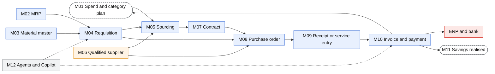
```mermaid
%%{init: {"flowchart": {"nodeSpacing": 28, "rankSpacing": 32, "padding": 8}}}%%
flowchart LR
  M01(["`M01 Spend and category plan`"]):::ho --> M05["`M05 Sourcing`"]:::usr
  M05 --> M07["`M07 Contract`"]:::usr
  M02["`M02 MRP`"]:::usr --> M04["`M04 Requisition`"]:::usr
  M03["`M03 Material master`"]:::usr --> M04
  M04 --> M05
  M04 --> M08["`M08 Purchase order`"]:::usr
  M07 --> M08
  M06["`M06 Qualified supplier`"]:::sup --> M05
  M06 --> M08
  M08 --> M09["`M09 Receipt or service entry`"]:::usr
  M09 --> M10["`M10 Invoice and payment`"]:::usr
  M10 --> ERP["`ERP and bank`"]:::ext
  M10 --> M11(["`M11 Savings realised`"]):::ho
  M10 --> M01
  M12["`M12 Agents and Copilot`"]:::sys -.-> M04
  M12 -.-> M10
  classDef usr fill:#e8f0fe,stroke:#3b6fd8,color:#111
  classDef sys fill:#f1f3f4,stroke:#80868b,color:#111
  classDef sup fill:#fff4e5,stroke:#e8a33d,color:#111
  classDef ext fill:#fce8e6,stroke:#d93025,color:#111
  classDef ho fill:#ffffff,stroke:#5f6368,stroke-dasharray:4 3,color:#111
```

| Hand-off | From → To | What passes |
|---|---|---|
| Planned order to requisition | M02 → M04 | Material, quantity, need date, plant, source of supply |
| Free-text line to new material | M04 → M03 | The line becomes a material request; the requisition does not wait |
| Requisition to sourcing | M04 → M05 | Approved lines without a source |
| Award to contract | M05 → M07 | One contract draft per awarded supplier |
| Requisition to purchase order | M04 → M08 | Approved lines with a source; price and terms from the contract |
| Receipt to invoice | M09 → M10 | Accepted quantities and approved service values for matching |
| Posted invoice to spend and savings | M10 → M01, M11 | Spend lines, realised savings |
| Payment | M10 → ERP, bank | Payment messages, bank files, bank results |

## The standard approval task

Every approval in PIC (requisition, PO, award, contract, invoice band, bank change, stock posting and others) runs through the same task inbox. This pattern is not repeated in each module.

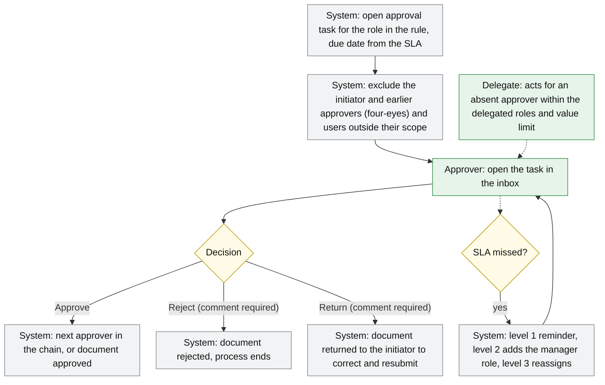
```mermaid
%%{init: {"flowchart": {"nodeSpacing": 28, "rankSpacing": 32, "padding": 8}}}%%
flowchart TD
  T1["`System: open approval task for the role in the rule, due date from the SLA`"]:::sys
  T2["`System: exclude the initiator and earlier approvers (four-eyes) and users outside their scope`"]:::sys
  T3["`Approver: open the task in the inbox`"]:::appr
  D1{"`Decision`"}:::dec
  T4["`System: next approver in the chain, or document approved`"]:::sys
  T5["`System: document rejected, process ends`"]:::sys
  T6["`System: document returned to the initiator to correct and resubmit`"]:::sys
  D2{"`SLA missed?`"}:::dec
  T7["`System: level 1 reminder, level 2 adds the manager role, level 3 reassigns`"]:::sys
  T8["`Delegate: acts for an absent approver within the delegated roles and value limit`"]:::appr
  T1 --> T2 --> T3 --> D1
  D1 -->|Approve| T4
  D1 -->|"Reject (comment required)"| T5
  D1 -->|"Return (comment required)"| T6
  T3 -.-> D2
  D2 -->|yes| T7 --> T3
  T8 -.-> T3
  classDef appr fill:#e6f4ea,stroke:#2e8b47,color:#111
  classDef sys fill:#f1f3f4,stroke:#80868b,color:#111
  classDef dec fill:#fffbe6,stroke:#b59500,color:#111
```

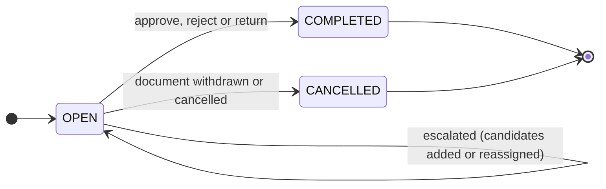
```mermaid
stateDiagram-v2
  direction LR
  [*] --> OPEN
  OPEN --> COMPLETED: approve, reject or return
  OPEN --> CANCELLED: document withdrawn or cancelled
  OPEN --> OPEN: escalated (candidates added or reassigned)
  COMPLETED --> [*]
  CANCELLED --> [*]
```

- Segregation of duties is checked when the second action is tried, for example "the person who created the PO cannot post its goods receipt" (SOD-03) and "the approver of an invoice cannot release its payment" (SOD-09). The full list of SOD-01 to SOD-11 is in the Workflow Guide, section "Controls that apply in every module".
- Approvers see only tasks they could complete: right role, not excluded by four-eyes, inside their company codes, plants, categories and value limit (decision D2).

---

## M01 Spend & Category Intelligence

Posted invoices become spend lines. The system classifies them and checks the maverick rules, and the cube is refreshed. Stewards review low-confidence classifications, owners work maverick hits, and category managers plan each category.

### Workflow 1 – Spend line, classification and maverick check

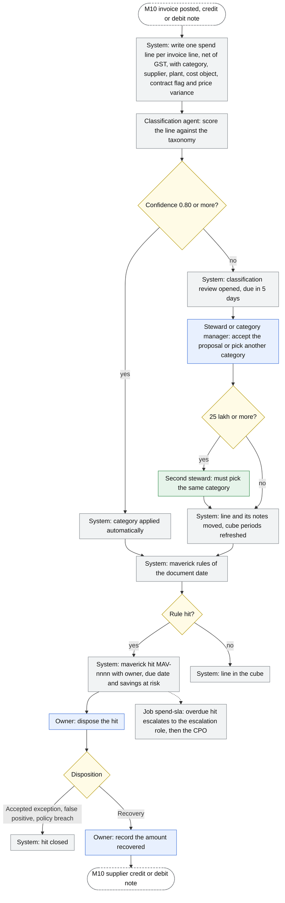
```mermaid
%%{init: {"flowchart": {"nodeSpacing": 28, "rankSpacing": 32, "padding": 8}}}%%
flowchart TD
  H0(["`M10 invoice posted, credit or debit note`"]):::ho
  S1["`System: write one spend line per invoice line, net of GST, with category, supplier, plant, cost object, contract flag and price variance`"]:::sys
  S2["`Classification agent: score the line against the taxonomy`"]:::sys
  D1{"`Confidence 0.80 or more?`"}:::dec
  S3["`System: category applied automatically`"]:::sys
  S4["`System: classification review opened, due in 5 days`"]:::sys
  U1["`Steward or category manager: accept the proposal or pick another category`"]:::usr
  D2{"`25 lakh or more?`"}:::dec
  A1["`Second steward: must pick the same category`"]:::appr
  S5["`System: line and its notes moved, cube periods refreshed`"]:::sys
  S6["`System: maverick rules of the document date`"]:::sys
  D3{"`Rule hit?`"}:::dec
  S7["`System: maverick hit MAV-nnnn with owner, due date and savings at risk`"]:::sys
  U2["`Owner: dispose the hit`"]:::usr
  D4{"`Disposition`"}:::dec
  S8["`System: hit closed`"]:::sys
  U3["`Owner: record the amount recovered`"]:::usr
  H1(["`M10 supplier credit or debit note`"]):::ho
  S9["`Job spend-sla: overdue hit escalates to the escalation role, then the CPO`"]:::sys
  H0 --> S1 --> S2 --> D1
  D1 -->|yes| S3 --> S6
  D1 -->|no| S4 --> U1 --> D2
  D2 -->|yes| A1 --> S5
  D2 -->|no| S5
  S5 --> S6
  S6 --> D3
  D3 -->|no| S10["`System: line in the cube`"]:::sys
  D3 -->|yes| S7 --> U2 --> D4
  D4 -->|"Accepted exception, false positive, policy breach"| S8
  D4 -->|Recovery| U3 --> H1
  S7 -.-> S9
  classDef usr fill:#e8f0fe,stroke:#3b6fd8,color:#111
  classDef appr fill:#e6f4ea,stroke:#2e8b47,color:#111
  classDef sys fill:#f1f3f4,stroke:#80868b,color:#111
  classDef dec fill:#fffbe6,stroke:#b59500,color:#111
  classDef ho fill:#ffffff,stroke:#5f6368,stroke-dasharray:4 3,color:#111
```

Notes:
- POs and goods receipts are never spend. Open PO value is shown separately as commitments.
- Accepting an exception above 1 crore needs the procurement head or CPO. Every disposition needs a comment.
- A foreign-currency line without an FX rate is left out of the totals until the rate is loaded.

### Workflow 2 – Category plan

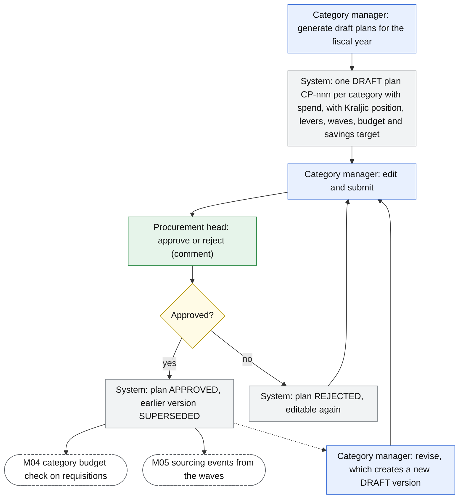
```mermaid
%%{init: {"flowchart": {"nodeSpacing": 28, "rankSpacing": 32, "padding": 8}}}%%
flowchart TD
  U1["`Category manager: generate draft plans for the fiscal year`"]:::usr
  S1["`System: one DRAFT plan CP-nnn per category with spend, with Kraljic position, levers, waves, budget and savings target`"]:::sys
  U2["`Category manager: edit and submit`"]:::usr
  A1["`Procurement head: approve or reject (comment)`"]:::appr
  D1{"`Approved?`"}:::dec
  S2["`System: plan APPROVED, earlier version SUPERSEDED`"]:::sys
  S3["`System: plan REJECTED, editable again`"]:::sys
  H1(["`M04 category budget check on requisitions`"]):::ho
  H2(["`M05 sourcing events from the waves`"]):::ho
  U3["`Category manager: revise, which creates a new DRAFT version`"]:::usr
  U1 --> S1 --> U2 --> A1 --> D1
  D1 -->|yes| S2
  D1 -->|no| S3 --> U2
  S2 --> H1
  S2 --> H2
  S2 -.-> U3 --> U2
  classDef usr fill:#e8f0fe,stroke:#3b6fd8,color:#111
  classDef appr fill:#e6f4ea,stroke:#2e8b47,color:#111
  classDef sys fill:#f1f3f4,stroke:#80868b,color:#111
  classDef dec fill:#fffbe6,stroke:#b59500,color:#111
  classDef ho fill:#ffffff,stroke:#5f6368,stroke-dasharray:4 3,color:#111
```

### Workflow 3 – Duplicate suppliers and data quality

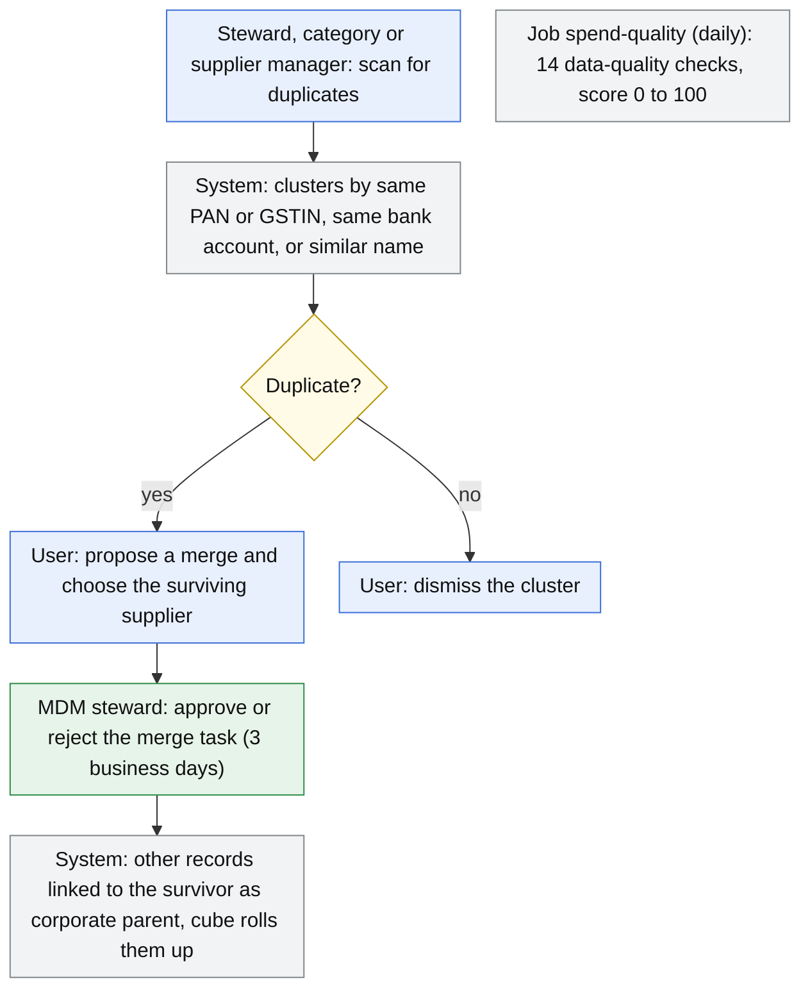
```mermaid
%%{init: {"flowchart": {"nodeSpacing": 28, "rankSpacing": 32, "padding": 8}}}%%
flowchart TD
  U1["`Steward, category or supplier manager: scan for duplicates`"]:::usr
  S1["`System: clusters by same PAN or GSTIN, same bank account, or similar name`"]:::sys
  D1{"`Duplicate?`"}:::dec
  U2["`User: propose a merge and choose the surviving supplier`"]:::usr
  A1["`MDM steward: approve or reject the merge task (3 business days)`"]:::appr
  S2["`System: other records linked to the survivor as corporate parent, cube rolls them up`"]:::sys
  U3["`User: dismiss the cluster`"]:::usr
  S3["`Job spend-quality (daily): 14 data-quality checks, score 0 to 100`"]:::sys
  U1 --> S1 --> D1
  D1 -->|yes| U2 --> A1 --> S2
  D1 -->|no| U3
  classDef usr fill:#e8f0fe,stroke:#3b6fd8,color:#111
  classDef appr fill:#e6f4ea,stroke:#2e8b47,color:#111
  classDef sys fill:#f1f3f4,stroke:#80868b,color:#111
  classDef dec fill:#fffbe6,stroke:#b59500,color:#111
```

Nothing is merged, blocked or deleted in the supplier master or in the ERP. The merge only changes how spend is rolled up.

### Document life cycles

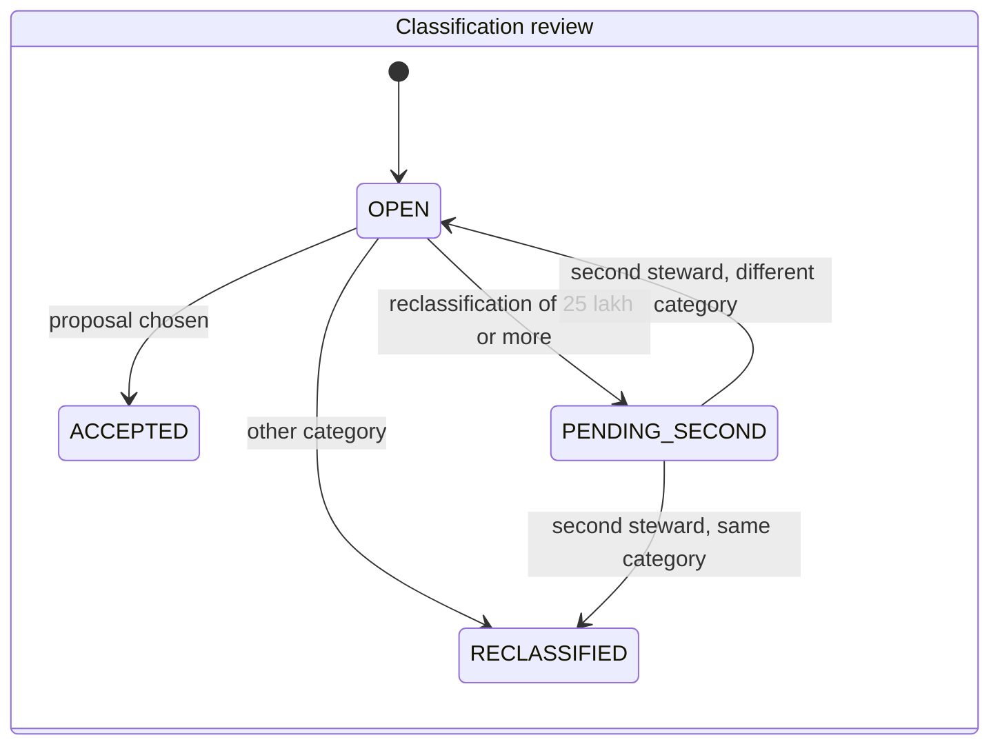
```mermaid
stateDiagram-v2
  direction LR
  state "Classification review" as CR {
    [*] --> OPEN
    OPEN --> ACCEPTED: proposal chosen
    OPEN --> RECLASSIFIED: other category
    OPEN --> PENDING_SECOND: reclassification of 25 lakh or more
    PENDING_SECOND --> RECLASSIFIED: second steward, same category
    PENDING_SECOND --> OPEN: second steward, different category
  }
```

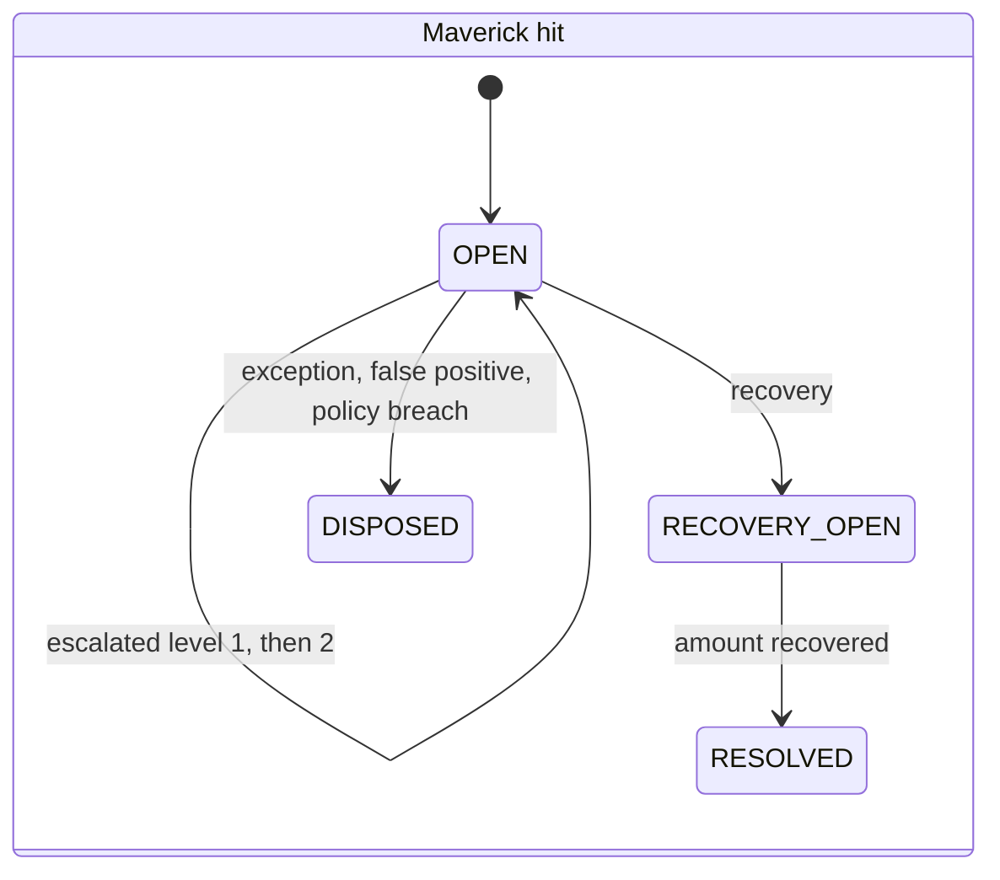
```mermaid
stateDiagram-v2
  direction LR
  state "Maverick hit" as MH {
    [*] --> OPEN
    OPEN --> OPEN: escalated level 1, then 2
    OPEN --> DISPOSED: exception, false positive, policy breach
    OPEN --> RECOVERY_OPEN: recovery
    RECOVERY_OPEN --> RESOLVED: amount recovered
  }
```

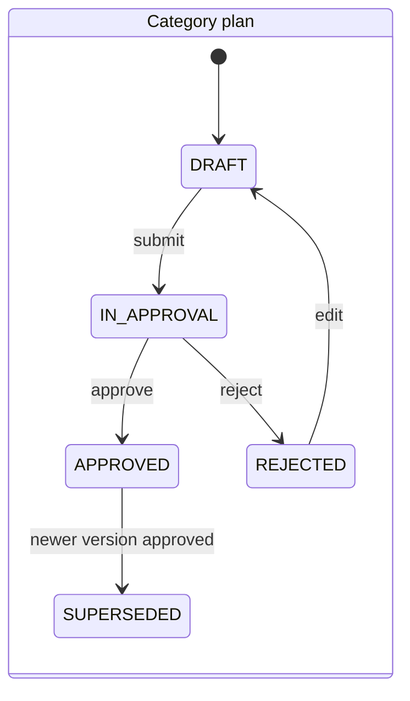
```mermaid
stateDiagram-v2
  direction LR
  state "Category plan" as CP {
    [*] --> DRAFT
    DRAFT --> IN_APPROVAL: submit
    IN_APPROVAL --> APPROVED: approve
    IN_APPROVAL --> REJECTED: reject
    REJECTED --> DRAFT: edit
    APPROVED --> SUPERSEDED: newer version approved
  }
```

---

## M02 MRP & Planning

MRP turns demand into planned orders, and the MRP controller converts them into requisitions. Kanban materials skip MRP. A forecast reaches MRP only after the controller releases it.

### Workflow 1 – MRP run to requisition

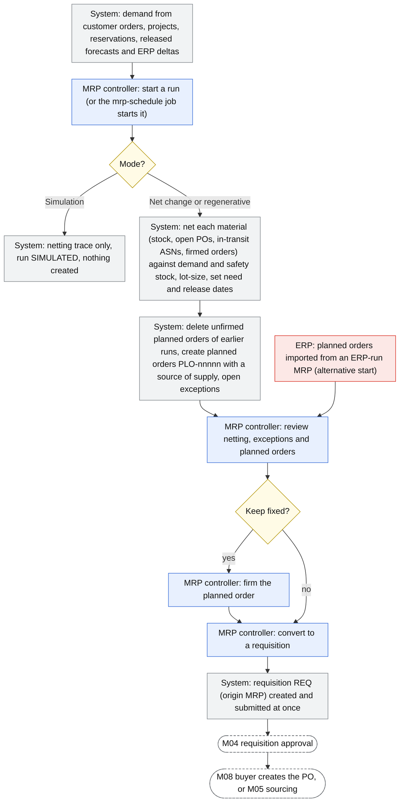
```mermaid
%%{init: {"flowchart": {"nodeSpacing": 28, "rankSpacing": 32, "padding": 8}}}%%
flowchart TD
  S0["`System: demand from customer orders, projects, reservations, released forecasts and ERP deltas`"]:::sys
  U1["`MRP controller: start a run (or the mrp-schedule job starts it)`"]:::usr
  E1["`ERP: planned orders imported from an ERP-run MRP (alternative start)`"]:::ext
  D1{"`Mode?`"}:::dec
  S1["`System: netting trace only, run SIMULATED, nothing created`"]:::sys
  S2["`System: net each material (stock, open POs, in-transit ASNs, firmed orders) against demand and safety stock, lot-size, set need and release dates`"]:::sys
  S3["`System: delete unfirmed planned orders of earlier runs, create planned orders PLO-nnnnn with a source of supply, open exceptions`"]:::sys
  U2["`MRP controller: review netting, exceptions and planned orders`"]:::usr
  D2{"`Keep fixed?`"}:::dec
  U3["`MRP controller: firm the planned order`"]:::usr
  U4["`MRP controller: convert to a requisition`"]:::usr
  S4["`System: requisition REQ (origin MRP) created and submitted at once`"]:::sys
  H1(["`M04 requisition approval`"]):::ho
  H2(["`M08 buyer creates the PO, or M05 sourcing`"]):::ho
  S0 --> U1 --> D1
  D1 -->|Simulation| S1
  D1 -->|"Net change or regenerative"| S2 --> S3 --> U2 --> D2
  E1 --> U2
  D2 -->|yes| U3 --> U4
  D2 -->|no| U4
  U4 --> S4 --> H1 --> H2
  classDef usr fill:#e8f0fe,stroke:#3b6fd8,color:#111
  classDef sys fill:#f1f3f4,stroke:#80868b,color:#111
  classDef ext fill:#fce8e6,stroke:#d93025,color:#111
  classDef dec fill:#fffbe6,stroke:#b59500,color:#111
  classDef ho fill:#ffffff,stroke:#5f6368,stroke-dasharray:4 3,color:#111
```

Notes:
- Source of supply order: active contract line, quota arrangement, source list, info record, then none (buyer queue). Blocked or unqualified suppliers are skipped.
- A firmed planned order is never changed by a later run. The run raises reschedule-in, reschedule-out or cancel messages on it instead.
- A planned order never becomes a PO directly (decision D1). It always passes through a requisition, so budget, quote and category checks always run.

### Workflow 2 – Kanban replenishment

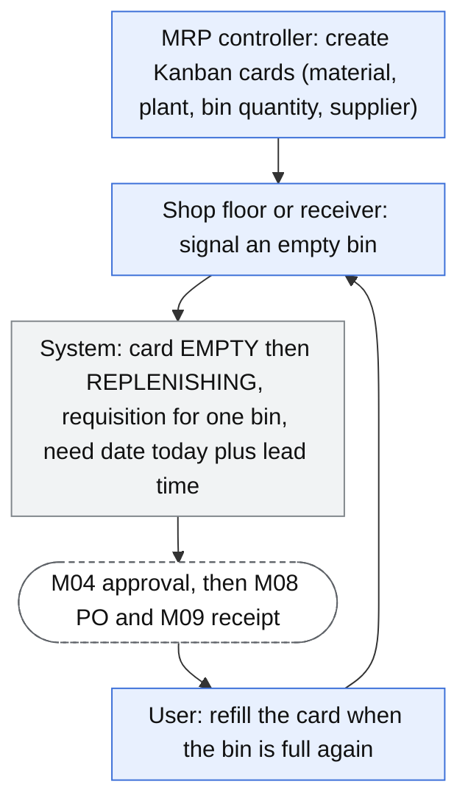
```mermaid
%%{init: {"flowchart": {"nodeSpacing": 28, "rankSpacing": 32, "padding": 8}}}%%
flowchart TD
  U1["`MRP controller: create Kanban cards (material, plant, bin quantity, supplier)`"]:::usr
  U2["`Shop floor or receiver: signal an empty bin`"]:::usr
  S1["`System: card EMPTY then REPLENISHING, requisition for one bin, need date today plus lead time`"]:::sys
  H1(["`M04 approval, then M08 PO and M09 receipt`"]):::ho
  U3["`User: refill the card when the bin is full again`"]:::usr
  U1 --> U2 --> S1 --> H1 --> U3 --> U2
  classDef usr fill:#e8f0fe,stroke:#3b6fd8,color:#111
  classDef sys fill:#f1f3f4,stroke:#80868b,color:#111
  classDef ho fill:#ffffff,stroke:#5f6368,stroke-dasharray:4 3,color:#111
```

### Workflow 3 – Forecast to demand

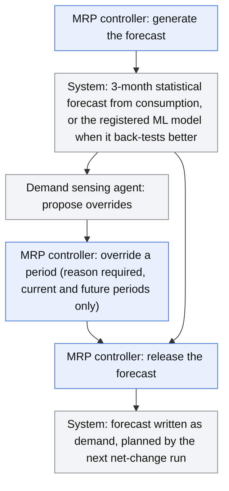
```mermaid
%%{init: {"flowchart": {"nodeSpacing": 28, "rankSpacing": 32, "padding": 8}}}%%
flowchart TD
  U1["`MRP controller: generate the forecast`"]:::usr
  S1["`System: 3-month statistical forecast from consumption, or the registered ML model when it back-tests better`"]:::sys
  S2["`Demand sensing agent: propose overrides`"]:::sys
  U2["`MRP controller: override a period (reason required, current and future periods only)`"]:::usr
  U3["`MRP controller: release the forecast`"]:::usr
  S3["`System: forecast written as demand, planned by the next net-change run`"]:::sys
  U1 --> S1 --> S2 --> U2 --> U3 --> S3
  S1 --> U3
  classDef usr fill:#e8f0fe,stroke:#3b6fd8,color:#111
  classDef sys fill:#f1f3f4,stroke:#80868b,color:#111
```

### Document life cycles

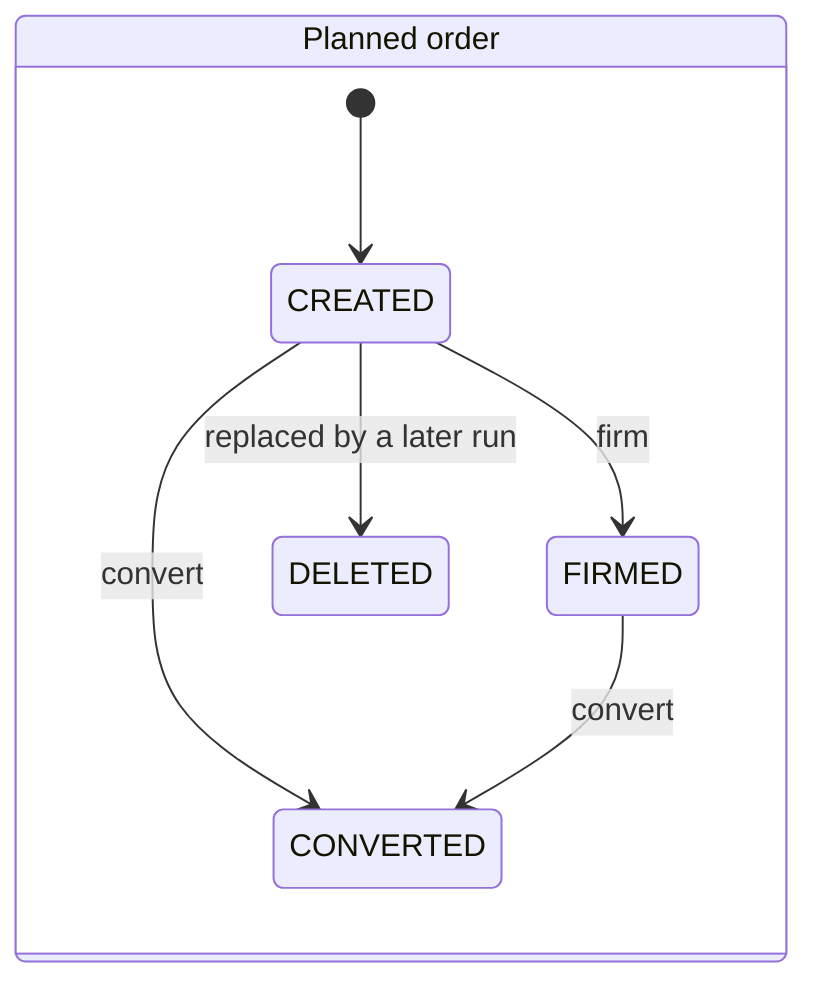
```mermaid
stateDiagram-v2
  direction LR
  state "Planned order" as PO {
    [*] --> CREATED
    CREATED --> FIRMED: firm
    CREATED --> CONVERTED: convert
    FIRMED --> CONVERTED: convert
    CREATED --> DELETED: replaced by a later run
  }
```

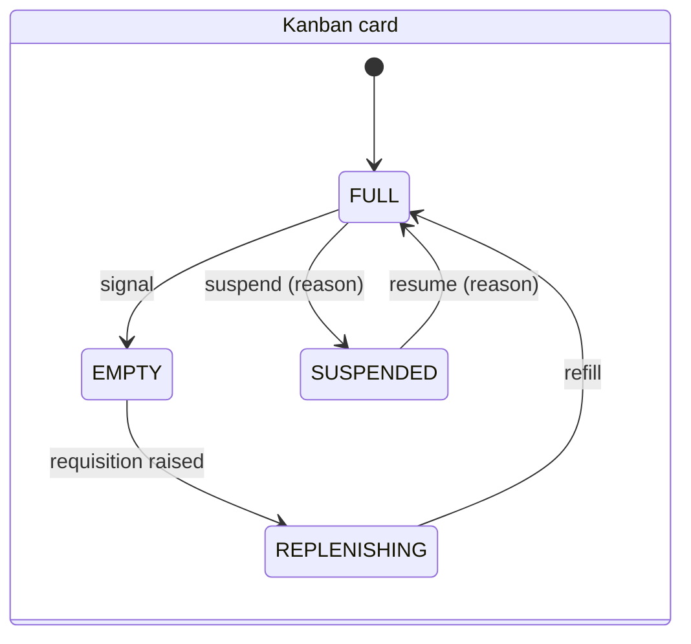
```mermaid
stateDiagram-v2
  direction LR
  state "Kanban card" as KB {
    [*] --> FULL
    FULL --> EMPTY: signal
    EMPTY --> REPLENISHING: requisition raised
    REPLENISHING --> FULL: refill
    FULL --> SUSPENDED: suspend (reason)
    SUSPENDED --> FULL: resume (reason)
  }
```

MRP run: `RUNNING` → `COMPLETED` (live run or ERP import) or `SIMULATED`.

---

## M03 Material & Master Data

A new material is checked for duplicates, approved by four data stewards and then sent to the ERP. A change to an existing material shows its impact first and is approved by the owning domains.

### Workflow 1 – New material

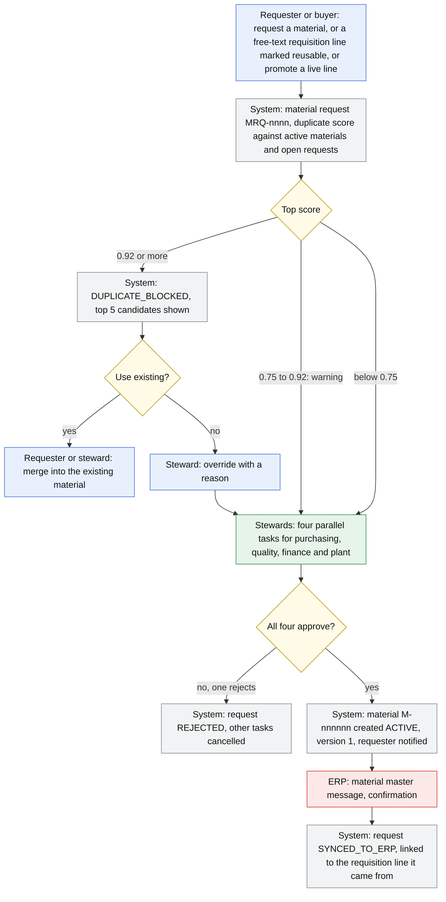
```mermaid
%%{init: {"flowchart": {"nodeSpacing": 28, "rankSpacing": 32, "padding": 8}}}%%
flowchart TD
  U1["`Requester or buyer: request a material, or a free-text requisition line marked reusable, or promote a live line`"]:::usr
  S1["`System: material request MRQ-nnnn, duplicate score against active materials and open requests`"]:::sys
  D1{"`Top score`"}:::dec
  S2["`System: DUPLICATE_BLOCKED, top 5 candidates shown`"]:::sys
  D2{"`Use existing?`"}:::dec
  U2["`Requester or steward: merge into the existing material`"]:::usr
  U3["`Steward: override with a reason`"]:::usr
  A1["`Stewards: four parallel tasks for purchasing, quality, finance and plant`"]:::appr
  D3{"`All four approve?`"}:::dec
  S3["`System: request REJECTED, other tasks cancelled`"]:::sys
  S4["`System: material M-nnnnnn created ACTIVE, version 1, requester notified`"]:::sys
  E1["`ERP: material master message, confirmation`"]:::ext
  S5["`System: request SYNCED_TO_ERP, linked to the requisition line it came from`"]:::sys
  U1 --> S1 --> D1
  D1 -->|"0.92 or more"| S2 --> D2
  D2 -->|yes| U2
  D2 -->|no| U3 --> A1
  D1 -->|"0.75 to 0.92: warning"| A1
  D1 -->|"below 0.75"| A1
  A1 --> D3
  D3 -->|"no, one rejects"| S3
  D3 -->|yes| S4 --> E1 --> S5
  classDef usr fill:#e8f0fe,stroke:#3b6fd8,color:#111
  classDef appr fill:#e6f4ea,stroke:#2e8b47,color:#111
  classDef sys fill:#f1f3f4,stroke:#80868b,color:#111
  classDef ext fill:#fce8e6,stroke:#d93025,color:#111
  classDef dec fill:#fffbe6,stroke:#b59500,color:#111
```

Notes:
- The requester cannot approve their own request as a steward (SOD-06).
- The requisition does not wait for the new material. The new material is linked to the line, but it never replaces the line's content.

### Workflow 2 – Change an existing material

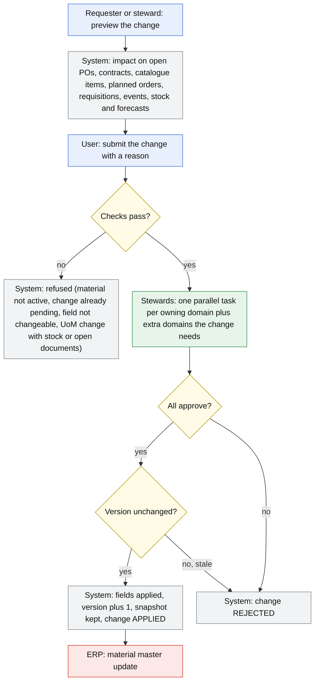
```mermaid
%%{init: {"flowchart": {"nodeSpacing": 28, "rankSpacing": 32, "padding": 8}}}%%
flowchart TD
  U1["`Requester or steward: preview the change`"]:::usr
  S1["`System: impact on open POs, contracts, catalogue items, planned orders, requisitions, events, stock and forecasts`"]:::sys
  U2["`User: submit the change with a reason`"]:::usr
  D1{"`Checks pass?`"}:::dec
  S2["`System: refused (material not active, change already pending, field not changeable, UoM change with stock or open documents)`"]:::sys
  A1["`Stewards: one parallel task per owning domain plus extra domains the change needs`"]:::appr
  D2{"`All approve?`"}:::dec
  D3{"`Version unchanged?`"}:::dec
  S3["`System: fields applied, version plus 1, snapshot kept, change APPLIED`"]:::sys
  S4["`System: change REJECTED`"]:::sys
  E1["`ERP: material master update`"]:::ext
  U1 --> S1 --> U2 --> D1
  D1 -->|no| S2
  D1 -->|yes| A1 --> D2
  D2 -->|no| S4
  D2 -->|yes| D3
  D3 -->|yes| S3 --> E1
  D3 -->|"no, stale"| S4
  classDef usr fill:#e8f0fe,stroke:#3b6fd8,color:#111
  classDef appr fill:#e6f4ea,stroke:#2e8b47,color:#111
  classDef sys fill:#f1f3f4,stroke:#80868b,color:#111
  classDef ext fill:#fce8e6,stroke:#d93025,color:#111
  classDef dec fill:#fffbe6,stroke:#b59500,color:#111
```

### Document life cycles

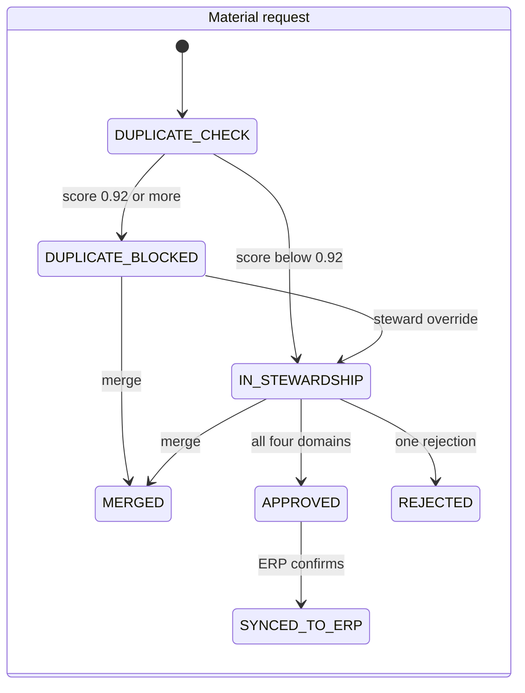
```mermaid
stateDiagram-v2
  direction LR
  state "Material request" as MR {
    [*] --> DUPLICATE_CHECK
    DUPLICATE_CHECK --> DUPLICATE_BLOCKED: score 0.92 or more
    DUPLICATE_CHECK --> IN_STEWARDSHIP: score below 0.92
    DUPLICATE_BLOCKED --> IN_STEWARDSHIP: steward override
    DUPLICATE_BLOCKED --> MERGED: merge
    IN_STEWARDSHIP --> MERGED: merge
    IN_STEWARDSHIP --> APPROVED: all four domains
    IN_STEWARDSHIP --> REJECTED: one rejection
    APPROVED --> SYNCED_TO_ERP: ERP confirms
  }
```

Material change request: `IN_APPROVAL` → `APPLIED`, `REJECTED` (including a stale version) or `CANCELLED` (withdrawn by the requester).

---

## M04 Requisition & Guided Buying

The requester searches first, then creates the requisition. It passes the policy and budget checks and is approved by value band and cost object. The buyer then turns it into a PO or a sourcing event.

### Workflow – Search to buyer workbench

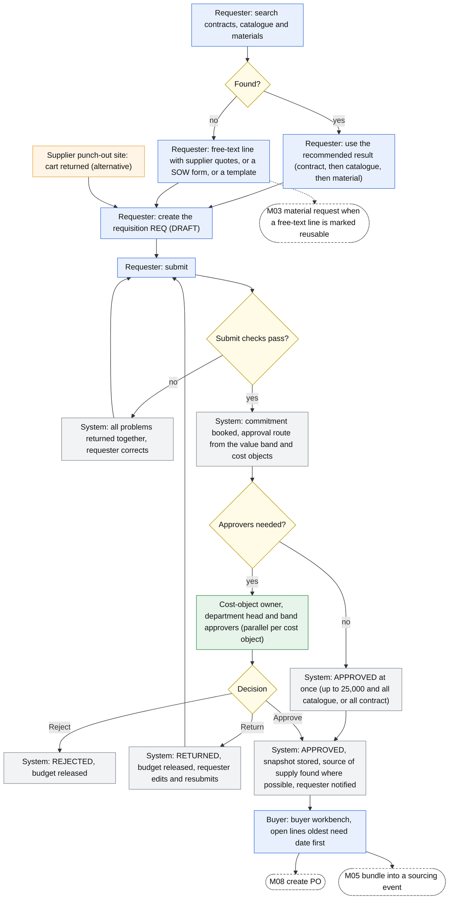
```mermaid
%%{init: {"flowchart": {"nodeSpacing": 28, "rankSpacing": 32, "padding": 8}}}%%
flowchart TD
  U1["`Requester: search contracts, catalogue and materials`"]:::usr
  D1{"`Found?`"}:::dec
  U2["`Requester: use the recommended result (contract, then catalogue, then material)`"]:::usr
  U3["`Requester: free-text line with supplier quotes, or a SOW form, or a template`"]:::usr
  P1["`Supplier punch-out site: cart returned (alternative)`"]:::sup
  U4["`Requester: create the requisition REQ (DRAFT)`"]:::usr
  H0(["`M03 material request when a free-text line is marked reusable`"]):::ho
  U5["`Requester: submit`"]:::usr
  D2{"`Submit checks pass?`"}:::dec
  S1["`System: all problems returned together, requester corrects`"]:::sys
  S2["`System: commitment booked, approval route from the value band and cost objects`"]:::sys
  D3{"`Approvers needed?`"}:::dec
  S3["`System: APPROVED at once (up to 25,000 and all catalogue, or all contract)`"]:::sys
  A1["`Cost-object owner, department head and band approvers (parallel per cost object)`"]:::appr
  D4{"`Decision`"}:::dec
  S4["`System: REJECTED, budget released`"]:::sys
  S5["`System: RETURNED, budget released, requester edits and resubmits`"]:::sys
  S6["`System: APPROVED, snapshot stored, source of supply found where possible, requester notified`"]:::sys
  U6["`Buyer: buyer workbench, open lines oldest need date first`"]:::usr
  H1(["`M08 create PO`"]):::ho
  H2(["`M05 bundle into a sourcing event`"]):::ho
  U1 --> D1
  D1 -->|yes| U2 --> U4
  D1 -->|no| U3 --> U4
  P1 --> U4
  U3 -.-> H0
  U4 --> U5 --> D2
  D2 -->|no| S1 --> U5
  D2 -->|yes| S2 --> D3
  D3 -->|no| S3 --> S6
  D3 -->|yes| A1 --> D4
  D4 -->|Reject| S4
  D4 -->|Return| S5 --> U5
  D4 -->|Approve| S6
  S6 --> U6
  U6 --> H1
  U6 --> H2
  classDef usr fill:#e8f0fe,stroke:#3b6fd8,color:#111
  classDef appr fill:#e6f4ea,stroke:#2e8b47,color:#111
  classDef sys fill:#f1f3f4,stroke:#80868b,color:#111
  classDef sup fill:#fff4e5,stroke:#e8a33d,color:#111
  classDef dec fill:#fffbe6,stroke:#b59500,color:#111
  classDef ho fill:#ffffff,stroke:#5f6368,stroke-dasharray:4 3,color:#111
```

Notes:
- Submit checks, in order: access scope, at least one line, purpose code, mandatory fields, per-line account assignment, material master where needed, quote policy, category-plan budget, cost-object budget. All problems come back together.
- After approval, a change of value, account or preferred supplier sends the requisition back to approval, and the budget is booked again. A change of date or description does not.
- A requisition already on a PO or in a sourcing event cannot be cancelled.
- A punch-out price more than 2 % above the hosted catalogue price is refused.

### Document life cycle

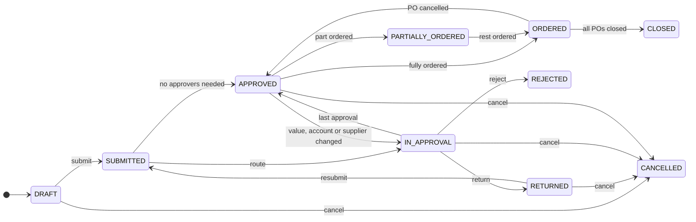
```mermaid
stateDiagram-v2
  direction LR
  [*] --> DRAFT
  DRAFT --> SUBMITTED: submit
  RETURNED --> SUBMITTED: resubmit
  SUBMITTED --> APPROVED: no approvers needed
  SUBMITTED --> IN_APPROVAL: route
  IN_APPROVAL --> APPROVED: last approval
  IN_APPROVAL --> REJECTED: reject
  IN_APPROVAL --> RETURNED: return
  APPROVED --> IN_APPROVAL: value, account or supplier changed
  APPROVED --> PARTIALLY_ORDERED: part ordered
  APPROVED --> ORDERED: fully ordered
  PARTIALLY_ORDERED --> ORDERED: rest ordered
  ORDERED --> APPROVED: PO cancelled
  ORDERED --> CLOSED: all POs closed
  DRAFT --> CANCELLED: cancel
  RETURNED --> CANCELLED: cancel
  IN_APPROVAL --> CANCELLED: cancel
  APPROVED --> CANCELLED: cancel
```

---

## M05 Strategic Sourcing

The buyer or category manager runs an RFI, RFQ, RFP or reverse auction for approved demand. Sealed bids are opened only after the close, then evaluated and scored. The award goes through its own approval and creates contract drafts.

### Workflow – Event to award

```mermaid
%%{init: {"flowchart": {"nodeSpacing": 28, "rankSpacing": 32, "padding": 8}}}%%
flowchart TD
  H0(["`M04 approved lines without a source`"]):::ho
  U1["`Category manager or buyer: build the event (lines, criteria and weights, invitees, baseline)`"]:::usr
  D1{"`Invitees qualified?`"}:::dec
  S1["`System: refused, unless conditional with a written waiver`"]:::sys
  U2["`Owner: publish (weights total 100, close in the future, budget check)`"]:::usr
  S2["`System: event OPEN, invitees notified, savings initiative IDENTIFIED`"]:::sys
  P1["`Supplier: questions until the clarification deadline, answers sent to all`"]:::sup
  P2["`Supplier: submit a sealed bid (or bid live in a reverse auction)`"]:::sup
  S3["`System: close at the close time, bids unsealed (two different managers must open when two-person opening is on)`"]:::sys
  U3["`Evaluators: declare conflicts of interest, score the criteria`"]:::usr
  D2{"`Another round?`"}:::dec
  U4["`Owner: compare TCO, build award scenarios`"]:::usr
  U5["`Owner: propose the award with a rationale`"]:::usr
  D3{"`Award gate passed?`"}:::dec
  S4["`System: award refused, start a new round, or category manager overrides an expired offer with a written reason`"]:::sys
  D4{"`Approval needed?`"}:::dec
  A1["`Approvers: category manager, CPO, finance controller (50 lakh or more, or an exception)`"]:::appr
  D5{"`Approved?`"}:::dec
  S5["`System: AWARDED, regret letters to the other bidders`"]:::sys
  H1(["`M07 one contract draft per awarded supplier`"]):::ho
  H2(["`M11 savings NEGOTIATED`"]):::ho
  H0 --> U1 --> D1
  D1 -->|no| S1 --> U1
  D1 -->|yes| U2 --> S2 --> P1 --> P2 --> S3 --> U3 --> D2
  D2 -->|yes| S2
  D2 -->|no| U4 --> U5 --> D3
  D3 -->|no| S4
  D3 -->|yes| D4
  D4 -->|no| S5
  D4 -->|yes| A1 --> D5
  D5 -->|yes| S5
  D5 -->|"no, back to evaluation"| U4
  S5 --> H1
  S5 --> H2
  classDef usr fill:#e8f0fe,stroke:#3b6fd8,color:#111
  classDef appr fill:#e6f4ea,stroke:#2e8b47,color:#111
  classDef sys fill:#f1f3f4,stroke:#80868b,color:#111
  classDef sup fill:#fff4e5,stroke:#e8a33d,color:#111
  classDef dec fill:#fffbe6,stroke:#b59500,color:#111
  classDef ho fill:#ffffff,stroke:#5f6368,stroke-dasharray:4 3,color:#111
```

Notes:
- Invitees must be qualified or preferred for the category, or conditional with a written waiver.
- The award gate checks that every bid is evaluated, the technical gate is passed, the offer is still valid and the lead time meets the need date.
- Bids are stored encrypted. Any attempt to read them before opening is refused and logged.
- A bid whose offer validity has passed blocks the award (decision D5). A category manager may override with a reason of at least 20 characters. The award then always goes to approval, and the person who overrode cannot approve it.
- The sole evaluator of an event cannot award it (SOD-05).
- An event can be cancelled with a reason at any point before it is awarded. Its lines go back to the buyer queue and the savings initiative is lost.

### Document life cycle

```mermaid
stateDiagram-v2
  direction LR
  [*] --> DRAFT
  DRAFT --> PUBLISHED: publish
  PUBLISHED --> OPEN: open time reached
  OPEN --> CLOSED: close time
  CLOSED --> UNDER_EVALUATION: bids unsealed
  UNDER_EVALUATION --> OPEN: new round
  UNDER_EVALUATION --> AWARD_PENDING: propose award
  AWARD_PENDING --> AWARDED: approved or no approval needed
  AWARD_PENDING --> UNDER_EVALUATION: award rejected
  DRAFT --> CANCELLED: cancel
  OPEN --> CANCELLED: cancel
  UNDER_EVALUATION --> CANCELLED: cancel
  AWARD_PENDING --> CANCELLED: cancel
```

Bid: `SEALED` → `UNSEALED`, or `WITHDRAWN`, `SUPERSEDED` (by a later round), `DISQUALIFIED`, `INVALID`.

---

## M06 Supplier Lifecycle & Performance

A supplier is invited, registers itself, and is screened. A second person verifies its bank account, and the supplier is qualified per category. After that, bank and master-data changes go through approval, and performance and risk are watched.

### Workflow 1 – Onboarding and qualification

```mermaid
%%{init: {"flowchart": {"nodeSpacing": 28, "rankSpacing": 32, "padding": 8}}}%%
flowchart TD
  U1["`Supplier manager: invite the supplier (one-time link, 14 days), or register it directly`"]:::usr
  P1["`Supplier: register through the link (tax IDs, password)`"]:::sup
  P2["`Supplier: profile, bank account and certificates in the portal`"]:::sup
  S1["`System: screening for duplicates (GSTIN, PAN, name) and sanctions`"]:::sys
  D1{"`Screening`"}:::dec
  S2["`System: supplier BLOCKED`"]:::sys
  U2["`Another supplier manager: clear, merge into the duplicate, or rescreen`"]:::usr
  U3["`Different person: phone the supplier on a known number, record the call-back`"]:::usr
  A1["`Two finance controllers: approve the bank account`"]:::appr
  U4["`Supplier manager: qualification per category (questionnaire, audit, sample approval), certificates verified`"]:::usr
  D2{"`Decision`"}:::dec
  S3["`System: category QUALIFIED or CONDITIONAL (written waiver), supplier ACTIVE on the first one`"]:::sys
  S4["`System: category EXITED`"]:::sys
  E1["`ERP: vendor created`"]:::ext
  H1(["`M05 invitations, M07 contracts, M08 POs`"]):::ho
  U1 --> P1 --> P2 --> S1 --> D1
  D1 -->|"Sanctions hit"| S2
  D1 -->|"Review"| U2 --> U3
  D1 -->|Clear| U3
  U3 --> A1 --> U4 --> D2
  D2 -->|"Qualified or conditional"| S3 --> E1 --> H1
  D2 -->|Rejected| S4
  classDef usr fill:#e8f0fe,stroke:#3b6fd8,color:#111
  classDef appr fill:#e6f4ea,stroke:#2e8b47,color:#111
  classDef sys fill:#f1f3f4,stroke:#80868b,color:#111
  classDef sup fill:#fff4e5,stroke:#e8a33d,color:#111
  classDef ext fill:#fce8e6,stroke:#d93025,color:#111
  classDef dec fill:#fffbe6,stroke:#b59500,color:#111
  classDef ho fill:#ffffff,stroke:#5f6368,stroke-dasharray:4 3,color:#111
```

QUALIFIED needs every mandatory certificate valid and verified, a questionnaire score of at least 70, an audit score of at least 75, and sample approval where the category requires it. Any positive decision also needs an active verified bank account and a passing screening.

### Workflow 2 – Bank account change

```mermaid
%%{init: {"flowchart": {"nodeSpacing": 28, "rankSpacing": 32, "padding": 8}}}%%
flowchart TD
  U1["`Supplier manager: request the bank change BCR-nnn (the portal cannot change bank details directly)`"]:::usr
  S1["`System: checks (supplier not blocked, no other change pending, IFSC or SWIFT), new account stored encrypted and inactive`"]:::sys
  U2["`A different person: call-back to the supplier, note recorded`"]:::usr
  A1["`Two finance controllers (not the requester or the caller): approve`"]:::appr
  D1{"`Both approve?`"}:::dec
  S2["`System: new account active, old ones deactivated, payments held for a 72-hour cooling-off`"]:::sys
  S3["`System: REJECTED, old account stays active`"]:::sys
  E1["`ERP: vendor bank update (active suppliers)`"]:::ext
  U1 --> S1 --> U2 --> A1 --> D1
  D1 -->|yes| S2 --> E1
  D1 -->|no| S3
  classDef usr fill:#e8f0fe,stroke:#3b6fd8,color:#111
  classDef appr fill:#e6f4ea,stroke:#2e8b47,color:#111
  classDef sys fill:#f1f3f4,stroke:#80868b,color:#111
  classDef ext fill:#fce8e6,stroke:#d93025,color:#111
  classDef dec fill:#fffbe6,stroke:#b59500,color:#111
```

The person who changes bank details can neither approve that supplier's payments (SOD-02) nor post its invoices (SOD-02a). An invoice that arrives within 30 days of a bank change raises a fraud signal.

### Workflow 3 – Tax ID, address and contact changes

```mermaid
%%{init: {"flowchart": {"nodeSpacing": 28, "rankSpacing": 32, "padding": 8}}}%%
flowchart TD
  U1["`Supplier manager, or the supplier's own portal user: request a TAX, ADDRESS or CONTACT change with a reason`"]:::usr
  S1["`System: validate (GSTIN check digit and state, PAN, PIN code), new values encrypted, change SMC-nnn IN_APPROVAL`"]:::sys
  A1["`Finance controller and supplier manager (two different people, not the requester): approve`"]:::appr
  D1{"`Both approve?`"}:::dec
  S2["`System: values applied, a TAX change is screened again, supplier and managers notified`"]:::sys
  S3["`System: REJECTED, master unchanged`"]:::sys
  E1["`ERP: vendor master update`"]:::ext
  U1 --> S1 --> A1 --> D1
  D1 -->|yes| S2 --> E1
  D1 -->|no| S3
  classDef usr fill:#e8f0fe,stroke:#3b6fd8,color:#111
  classDef appr fill:#e6f4ea,stroke:#2e8b47,color:#111
  classDef sys fill:#f1f3f4,stroke:#80868b,color:#111
  classDef ext fill:#fce8e6,stroke:#d93025,color:#111
  classDef dec fill:#fffbe6,stroke:#b59500,color:#111
```

### Workflow 4 – Performance, CAPA, risk and blocking

```mermaid
%%{init: {"flowchart": {"nodeSpacing": 28, "rankSpacing": 32, "padding": 8}}}%%
flowchart TD
  S1["`System: monthly scorecard from receipts (OTIF), quality decisions (PPM), invoices (first-pass accuracy) and bids (responsiveness)`"]:::sys
  H0(["`M09 quantity rejected at the usage decision`"]):::ho
  S2["`System: CAPA opened`"]:::sys
  P1["`Supplier: root cause and actions`"]:::sup
  U1["`Quality: verify, close or reopen`"]:::usr
  S3["`Supplier risk agent: signals (sanctions, certificates expiring, OTIF below 90 %, PPM above 1000, late-delivery risk, bank change fraud, concentration)`"]:::sys
  U2["`Supplier manager: record the mitigation`"]:::usr
  D1{"`Block needed?`"}:::dec
  U3["`Supplier manager: block (automatic on a sanctions hit)`"]:::usr
  S4["`System: categories BLOCKED, unpaid invoices get a payment block, a buyer review task per open PO`"]:::sys
  H0 --> S2 --> P1 --> U1
  S1 --> S3 --> U2 --> D1
  D1 -->|yes| U3 --> S4
  classDef usr fill:#e8f0fe,stroke:#3b6fd8,color:#111
  classDef sys fill:#f1f3f4,stroke:#80868b,color:#111
  classDef sup fill:#fff4e5,stroke:#e8a33d,color:#111
  classDef dec fill:#fffbe6,stroke:#b59500,color:#111
  classDef ho fill:#ffffff,stroke:#5f6368,stroke-dasharray:4 3,color:#111
```

### Document life cycles

```mermaid
stateDiagram-v2
  direction LR
  state "Category status per supplier" as CS {
    [*] --> REGISTERED
    REGISTERED --> UNDER_QUALIFICATION: qualification started
    UNDER_QUALIFICATION --> QUALIFIED: decision
    UNDER_QUALIFICATION --> CONDITIONAL: decision with waiver
    UNDER_QUALIFICATION --> EXITED: rejected
    QUALIFIED --> PREFERRED: OTIF 95 % and PPM within limit
    QUALIFIED --> CONDITIONAL: mandatory certificate expired
    PREFERRED --> CONDITIONAL: mandatory certificate expired
    QUALIFIED --> BLOCKED: block
    BLOCKED --> QUALIFIED: unblock restores the previous status
  }
```

```mermaid
stateDiagram-v2
  direction LR
  state "Bank change" as BC {
    [*] --> PENDING_CALLBACK
    PENDING_CALLBACK --> PENDING_APPROVAL: call-back recorded
    PENDING_APPROVAL --> APPROVED: two approvals
    PENDING_APPROVAL --> REJECTED: any rejection
  }
```

Supplier: `REGISTERED` → `ACTIVE` (first positive qualification) → `BLOCKED` → previous status (unblock), or `REGISTERED` → `MERGED`. Master change: `IN_APPROVAL` → `APPLIED` or `REJECTED`. CAPA: `OPEN` → `RESPONDED` → `CLOSED` (or back to `OPEN`).

---

## M07 Contract Lifecycle Management

A contract starts from an award or by hand. It is drafted from the clause playbook, negotiated with the supplier, approved and signed by both sides, and then activated. After activation the system tracks consumption, index resets, obligations, amendments, renewal and rebates.

### Workflow 1 – Draft to active contract

```mermaid
%%{init: {"flowchart": {"nodeSpacing": 28, "rankSpacing": 32, "padding": 8}}}%%
flowchart TD
  H0(["`M05 award`"]):::ho
  U0["`Contract manager: new contract (alternative start)`"]:::usr
  S1["`System: DRAFT SA-nnnn, clauses from the playbook for the type, category and governing law, standard obligations, price validity per line`"]:::sys
  U1["`Contract manager: start the review`"]:::usr
  S2["`Contract review agent: score every clause against the standard (standard, fallback, non-standard), suggest fallbacks`"]:::sys
  P1["`Supplier: redline clauses in the portal`"]:::sup
  U2["`Contract manager: accept or restore each supplier redline`"]:::usr
  U3["`Contract manager: submit (refused while a supplier redline is unreviewed)`"]:::usr
  D1{"`Legal route?`"}:::dec
  A1["`Legal, finance controller, CPO (1 crore or more, or a non-standard clause)`"]:::appr
  A2["`Contract manager approval`"]:::appr
  D2{"`Approved?`"}:::dec
  U4["`Buyer and supplier: each sign once (or through the e-signature provider)`"]:::usr
  U5["`Contract manager: activate (both signatures on the same document hash, supplier not blocked)`"]:::usr
  S3["`System: ACTIVE, prices published, quota arrangement and source list updated, renewal and expiry timers set`"]:::sys
  H1(["`M08 PO source determination`"]):::ho
  H2(["`M11 savings CONTRACTED`"]):::ho
  H0 --> S1
  U0 --> S1
  S1 --> U1 --> S2 --> P1 --> U2 --> U3 --> D1
  D1 -->|yes| A1 --> D2
  D1 -->|no| A2 --> D2
  D2 -->|"no, back to negotiation"| U2
  D2 -->|yes| U4 --> U5 --> S3
  S3 --> H1
  S3 --> H2
  classDef usr fill:#e8f0fe,stroke:#3b6fd8,color:#111
  classDef appr fill:#e6f4ea,stroke:#2e8b47,color:#111
  classDef sys fill:#f1f3f4,stroke:#80868b,color:#111
  classDef sup fill:#fff4e5,stroke:#e8a33d,color:#111
  classDef dec fill:#fffbe6,stroke:#b59500,color:#111
  classDef ho fill:#ffffff,stroke:#5f6368,stroke-dasharray:4 3,color:#111
```

### Workflow 2 – Running the contract

```mermaid
%%{init: {"flowchart": {"nodeSpacing": 28, "rankSpacing": 32, "padding": 8}}}%%
flowchart TD
  S1["`System: every released, changed or closed PO updates the consumption per contract line`"]:::sys
  S2["`System: alerts at 80, 90 and 100 % of the target`"]:::sys
  U1["`Contract manager: index reset from a feed or by hand`"]:::usr
  D1{"`Within the band?`"}:::dec
  S3["`System: price unchanged, avoided increase booked as cost avoidance (M11)`"]:::sys
  S4["`System: new price period moved by the excess`"]:::sys
  U2["`Contract manager: amendment (variation, extension, terms or termination)`"]:::usr
  A1["`Approval chain from the amendment rule (legal, finance controller, CPO for large or non-standard changes)`"]:::appr
  S5["`System: applied on the effective date, contract version plus 1, new price periods`"]:::sys
  S6["`System: at the renewal notice date the contract is EXPIRING and a renewal task opens`"]:::sys
  D2{"`Renew?`"}:::dec
  S7["`System: extension amendment drafted, contract ACTIVE again with a later end date once approved`"]:::sys
  S8["`System: EXPIRED at the end date`"]:::sys
  S1 --> S2
  U1 --> D1
  D1 -->|yes| S3
  D1 -->|no| S4
  U2 --> A1 --> S5
  S6 --> D2
  D2 -->|yes| S7
  D2 -->|no| S8
  classDef usr fill:#e8f0fe,stroke:#3b6fd8,color:#111
  classDef appr fill:#e6f4ea,stroke:#2e8b47,color:#111
  classDef sys fill:#f1f3f4,stroke:#80868b,color:#111
  classDef dec fill:#fffbe6,stroke:#b59500,color:#111
```

Termination creates a termination amendment (90 days' notice by default, immediate for cause). When it is applied, the contract becomes `TERMINATED`, its prices and quota end, and each open PO gets a buyer review task. Rebates accrue from posted invoices net of credit notes and are settled after the period with a vendor credit memo to the ERP.

### Document life cycle

```mermaid
stateDiagram-v2
  direction LR
  [*] --> DRAFT
  DRAFT --> IN_NEGOTIATION: review
  IN_NEGOTIATION --> IN_APPROVAL: submit
  IN_APPROVAL --> OUT_FOR_SIGNATURE: approved
  IN_APPROVAL --> IN_NEGOTIATION: rejected
  OUT_FOR_SIGNATURE --> ACTIVE: activate
  ACTIVE --> EXPIRING: renewal notice date
  EXPIRING --> ACTIVE: extension approved
  ACTIVE --> EXPIRED: end date
  EXPIRING --> EXPIRED: end date
  ACTIVE --> TERMINATED: termination effective
  EXPIRING --> TERMINATED: termination effective
```

Amendment: `DRAFT` → `IN_APPROVAL` → `APPROVED` → `EFFECTIVE`; rejected, withdrawn or lapsed → `REJECTED`; returned → `DRAFT`.

---

## M08 Purchase Orders & Supplier Collaboration

The buyer creates POs from approved requisitions. The system finds the source and checks price and risk, and either releases the PO touchlessly or routes it for approval. The PO is then sent to the supplier, who confirms it or proposes changes.

### Workflow – Requisition to confirmed PO

```mermaid
%%{init: {"flowchart": {"nodeSpacing": 28, "rankSpacing": 32, "padding": 8}}}%%
flowchart TD
  H0(["`M04 approved requisition lines`"]):::ho
  U1["`Buyer: create the PO (with a contract, a supplier, or neither)`"]:::usr
  S1["`System: source determination (contract line, quota, source list, info record), blocked and unqualified suppliers excluded`"]:::sys
  D1{"`Source found?`"}:::dec
  H1(["`M05 start a sourcing event`"]):::ho
  S2["`System: one DRAFT PO per supplier, price and terms from the contract, purchase-type flags`"]:::sys
  S3["`System: price check (above contract or last price paid needs a reason), risk score, split detection, PO validation agent`"]:::sys
  D2{"`Touchless?`"}:::dec
  S4["`System: released by the agent`"]:::sys
  S5["`System: release checks (supplier not blocked, mandatory fields, one-time-vendor gate up to 5 lakh)`"]:::sys
  A1["`Approvers: buyer up to 5 lakh, buyer and procurement head above, plus buyer lead for price deviations`"]:::appr
  D3{"`Approved?`"}:::dec
  U2["`Buyer: correct and resubmit`"]:::usr
  S6["`System: RELEASED and TRANSMITTED by portal, EDI or e-mail, ERP purchase order message, confirmation due in 24 hours`"]:::sys
  P1["`Supplier: confirm or propose a change`"]:::sup
  D4{"`Within tolerance?`"}:::dec
  S7["`System: CONFIRMED, confirmed dates on the schedule lines`"]:::sys
  U3["`Buyer: review the change, accept as a change order or decline`"]:::usr
  S8["`System: no answer in 24 hours, expedite task for the buyer with a drafted message`"]:::sys
  H2(["`M09 ASN and goods receipt`"]):::ho
  H0 --> U1 --> S1 --> D1
  D1 -->|no| H1
  D1 -->|yes| S2 --> S3 --> D2
  D2 -->|yes| S4 --> S6
  D2 -->|no| S5 --> A1 --> D3
  D3 -->|"no, back to DRAFT"| U2 --> S5
  D3 -->|yes| S6
  S6 --> P1 --> D4
  D4 -->|yes| S7 --> H2
  D4 -->|no| U3 --> S6
  S6 -.-> S8
  classDef usr fill:#e8f0fe,stroke:#3b6fd8,color:#111
  classDef appr fill:#e6f4ea,stroke:#2e8b47,color:#111
  classDef sys fill:#f1f3f4,stroke:#80868b,color:#111
  classDef sup fill:#fff4e5,stroke:#e8a33d,color:#111
  classDef dec fill:#fffbe6,stroke:#b59500,color:#111
  classDef ho fill:#ffffff,stroke:#5f6368,stroke-dasharray:4 3,color:#111
```

Notes:
- Touchless release needs all of these: contract or catalogue price, qualified or preferred supplier, value up to 25 lakh, no split pattern, late-delivery probability below 0.30, risk score below 30, account assignment unchanged, and the touchless agent allowed.
- Change orders create a new PO version and keep a snapshot of the old one. The PO is sent again and the supplier confirms it again. A price deviation always needs approval first.
- The person who created a PO cannot post its goods receipt (SOD-03) or approve its invoice exceptions (SOD-04).
- A PO can be cancelled while nothing has been shipped, received or invoiced. The requisition quantity is reopened and the supplier and ERP are told.
- The category check on PO create and release is off by default (decision D3) and can be switched on per company code.

### Document life cycle

```mermaid
stateDiagram-v2
  direction LR
  [*] --> DRAFT
  DRAFT --> IN_APPROVAL: route
  DRAFT --> RELEASED: touchless
  IN_APPROVAL --> RELEASED: last approval
  IN_APPROVAL --> DRAFT: reject
  RELEASED --> TRANSMITTED: sent
  TRANSMITTED --> CONFIRMED: supplier confirms
  CONFIRMED --> TRANSMITTED: change order
  CONFIRMED --> PARTIALLY_RECEIVED: part received
  CONFIRMED --> RECEIVED: fully received
  PARTIALLY_RECEIVED --> RECEIVED: rest received
  PARTIALLY_RECEIVED --> CLOSED: short close
  RECEIVED --> INVOICED: invoice
  INVOICED --> CLOSED: close
  DRAFT --> CANCELLED: cancel
  TRANSMITTED --> CANCELLED: cancel
  CONFIRMED --> CANCELLED: cancel
```

A goods receipt reversal moves `RECEIVED` or `PARTIALLY_RECEIVED` back. A receipt-less expense PO goes from `CONFIRMED` straight to `INVOICED`.

---

## M09 Receiving, Quality & Inventory

The supplier ships with an ASN and the receiver posts the goods receipt. Quality-managed goods wait for the inspector's decision. Services are confirmed with service entry sheets. Stock postings and stock counts have their own approvals.

### Workflow 1 – Goods receipt and quality

```mermaid
%%{init: {"flowchart": {"nodeSpacing": 28, "rankSpacing": 32, "padding": 8}}}%%
flowchart TD
  P1["`Supplier: ASN with batches (e-way bill required above 50,000)`"]:::sup
  U1["`Receiver: post the goods receipt against the PO`"]:::usr
  D1{"`Checks pass?`"}:::dec
  S1["`System: refused with the reason`"]:::sys
  D2{"`Quality-managed?`"}:::dec
  S2["`System: stock to quality inspection, inspection lot with sample size`"]:::sys
  U2["`Quality inspector: usage decision (accepted and rejected quantities, defect code)`"]:::usr
  D3{"`Rejected qty?`"}:::dec
  S3["`System: accepted quantity to unrestricted stock`"]:::sys
  S4["`System: rejected quantity blocked and returned (return delivery), CAPA opened`"]:::sys
  D4{"`Replacement?`"}:::dec
  S5["`System: quantity reopened on the PO for a new delivery`"]:::sys
  H1(["`M10 supplier credit note`"]):::ho
  S6["`System: receipt ACCEPTED, stock to unrestricted`"]:::sys
  E1["`ERP: goods receipt message`"]:::ext
  H2(["`M10 invoice matching against accepted quantity`"]):::ho
  P1 --> U1 --> D1
  D1 -->|no| S1
  D1 -->|yes| D2
  D2 -->|yes| S2 --> U2 --> D3
  D3 -->|no| S3 --> E1
  D3 -->|yes| S4 --> S3
  S4 --> D4
  D4 -->|yes| S5
  D4 -->|no| H1
  D2 -->|no| S6 --> E1
  E1 --> H2
  classDef usr fill:#e8f0fe,stroke:#3b6fd8,color:#111
  classDef sys fill:#f1f3f4,stroke:#80868b,color:#111
  classDef sup fill:#fff4e5,stroke:#e8a33d,color:#111
  classDef ext fill:#fce8e6,stroke:#d93025,color:#111
  classDef dec fill:#fffbe6,stroke:#b59500,color:#111
  classDef ho fill:#ffffff,stroke:#5f6368,stroke-dasharray:4 3,color:#111
```

Receipt checks: the receiver is not the PO creator, the plant is in their scope, over-delivery is within tolerance, batch, expiry and serial numbers are captured where the material needs them, and the posting period is open.

A goods receipt can be reversed with a reason while no invoice uses it. Stock is taken back, the ASN and PO quantities are reopened, and a reversal goes to the ERP.

### Workflow 2 – Service entry

```mermaid
%%{init: {"flowchart": {"nodeSpacing": 28, "rankSpacing": 32, "padding": 8}}}%%
flowchart TD
  P1["`Supplier (or internal user): service entry sheet on a service PO line (milestone, time and material, unit rate or progress)`"]:::sup
  D1{"`Within PO value?`"}:::dec
  S1["`System: refused`"]:::sys
  A1["`Service owner (not the supplier who entered it, not the PO creator): approve or reject`"]:::appr
  D2{"`Approved?`"}:::dec
  S2["`System: approved value added to the PO line`"]:::sys
  S3["`System: REJECTED, can be corrected and resubmitted`"]:::sys
  H1(["`M10 invoice matched against the approved service value`"]):::ho
  P1 --> D1
  D1 -->|no| S1
  D1 -->|yes| A1 --> D2
  D2 -->|yes| S2 --> H1
  D2 -->|no| S3 --> P1
  classDef appr fill:#e6f4ea,stroke:#2e8b47,color:#111
  classDef sys fill:#f1f3f4,stroke:#80868b,color:#111
  classDef sup fill:#fff4e5,stroke:#e8a33d,color:#111
  classDef dec fill:#fffbe6,stroke:#b59500,color:#111
  classDef ho fill:#ffffff,stroke:#5f6368,stroke-dasharray:4 3,color:#111
```

### Workflow 3 – Stock posting and physical inventory

```mermaid
%%{init: {"flowchart": {"nodeSpacing": 28, "rankSpacing": 32, "padding": 8}}}%%
flowchart TD
  U1["`Inventory user: stock posting (transfer, block, unblock, scrap) and submit. Below 25,000 and not scrap: auto-post`"]:::usr
  D1{"`Auto-post?`"}:::dec
  S1["`System: approved by rule and posted at once`"]:::sys
  A1["`Approval chain by value band (not the maker)`"]:::appr
  U2["`Inventory user: post (stock re-checked)`"]:::usr
  E1["`ERP: stock posting message`"]:::ext
  U3["`Inventory controller: create the count, book quantities frozen`"]:::usr
  U4["`Receivers: blind count`"]:::usr
  D2{"`Above tolerance?`"}:::dec
  U5["`A different person: recount`"]:::usr
  A2["`Approver (never a counter): approve the differences`"]:::appr
  S2["`System: gains and losses posted against the frozen book quantity`"]:::sys
  U1 --> D1
  D1 -->|yes| S1 --> E1
  D1 -->|"no, or scrap"| A1 --> U2 --> E1
  U3 --> U4 --> D2
  D2 -->|yes| U5 --> A2
  D2 -->|no| A2
  A2 --> S2 --> E1
  classDef usr fill:#e8f0fe,stroke:#3b6fd8,color:#111
  classDef appr fill:#e6f4ea,stroke:#2e8b47,color:#111
  classDef sys fill:#f1f3f4,stroke:#80868b,color:#111
  classDef ext fill:#fce8e6,stroke:#d93025,color:#111
  classDef dec fill:#fffbe6,stroke:#b59500,color:#111
```

Also in M09: subcontracting (components sent to the subcontractor and consumed at receipt), consignment withdrawals (create the liability, settled by self-billing in M10), lot recalls, and reservations (open quantity is demand for MRP).

### Document life cycles

```mermaid
stateDiagram-v2
  direction LR
  state "Goods receipt" as GR {
    [*] --> POSTED
    POSTED --> QUALITY_HOLD: quality-managed line
    POSTED --> ACCEPTED: no quality hold
    QUALITY_HOLD --> ACCEPTED: all accepted
    QUALITY_HOLD --> PARTIALLY_REJECTED: part rejected
    QUALITY_HOLD --> REJECTED: all rejected
    ACCEPTED --> REVERSED: reversal
    QUALITY_HOLD --> REVERSED: reversal
  }
```

```mermaid
stateDiagram-v2
  direction LR
  state "Physical inventory" as PI {
    [*] --> PLANNED
    PLANNED --> COUNTING: first count
    COUNTING --> COUNTED: complete
    COUNTED --> PENDING_APPROVAL: submit
    PENDING_APPROVAL --> APPROVED: approve
    PENDING_APPROVAL --> COUNTING: reject or reopen
    APPROVED --> POSTED: post
  }
```

Service entry: `DRAFT` → `SUBMITTED` → `APPROVED` (or `REJECTED` → resubmitted). Stock posting: `DRAFT` → `SUBMITTED` → `APPROVED` → `POSTED`, or `REJECTED` or `CANCELLED`. ASN: `IN_TRANSIT` → `RECEIVED`.

---

## M10 Invoice Matching, Payables & Finance

Invoices are captured and checked for duplicates, then matched against PO, receipt and service entry. Exceptions are resolved by AP. The invoice is approved by value band and posted to the ERP. Payment runs can pay invoices in full or in parts, apply TDS (including section 195 for non-residents) and produce bank files.

### Workflow 1 – Invoice to posting

```mermaid
%%{init: {"flowchart": {"nodeSpacing": 28, "rankSpacing": 32, "padding": 8}}}%%
flowchart TD
  P1["`Supplier (portal, e-invoice, EDI) or AP clerk (PDF with OCR): capture the invoice`"]:::sup
  D1{"`Capture checks pass?`"}:::dec
  S1["`System: refused with the reason`"]:::sys
  S2["`System: duplicate check (same supplier, same amount within 3 days, or a variant of an earlier number)`"]:::sys
  S3["`System: match each line (2-, 3- or 4-way, service entry, consignment), price and tax tolerance`"]:::sys
  D2{"`Exceptions?`"}:::dec
  S4["`System: EXCEPTION, payment block, exception agent drafts the cause`"]:::sys
  U1["`AP clerk (not the PO creator): resolve with a credit note, accepted price (buyer task), posted receipt, or dispute`"]:::usr
  U2["`AP clerk (not the capturer): approve`"]:::appr
  D3{"`Gross value`"}:::dec
  A1["`Finance controller`"]:::appr
  A2["`Finance controller, then CFO`"]:::appr
  D4{"`Approved?`"}:::dec
  S5["`System: approval exception back to AP with a payment block`"]:::sys
  U3["`AP clerk: post to the ERP with the posting key`"]:::usr
  E1["`ERP: supplier invoice posted (gross, tax heads, reverse charge, TDS, retention)`"]:::ext
  S6["`System: POSTED, due date set`"]:::sys
  H1(["`M01 spend, M11 savings, M06 scorecard, M07 rebate accrual`"]):::ho
  P1 --> D1
  D1 -->|no| S1
  D1 -->|yes| S2 --> S3 --> D2
  D2 -->|yes| S4 --> U1 --> S3
  D2 -->|no| U2 --> D3
  D3 -->|"below 10 lakh"| U3
  D3 -->|"10 lakh to 1 crore"| A1 --> D4
  D3 -->|"1 crore or more"| A2 --> D4
  D4 -->|yes| U3
  D4 -->|"no, reject or return"| S5 --> U1
  U3 --> E1 --> S6 --> H1
  classDef usr fill:#e8f0fe,stroke:#3b6fd8,color:#111
  classDef appr fill:#e6f4ea,stroke:#2e8b47,color:#111
  classDef sys fill:#f1f3f4,stroke:#80868b,color:#111
  classDef sup fill:#fff4e5,stroke:#e8a33d,color:#111
  classDef ext fill:#fce8e6,stroke:#d93025,color:#111
  classDef dec fill:#fffbe6,stroke:#b59500,color:#111
  classDef ho fill:#ffffff,stroke:#5f6368,stroke-dasharray:4 3,color:#111
```

Notes:
- Capture checks: not a duplicate invoice number or IRN, supplier not blocked, only the supplier's own POs, one currency, GST heads adding up to the line tax, and a valid e-invoice IRN and QR.
- The invoice approval bands are on the gross value with GST, in company-code currency. Nobody approves twice in one chain: the AP approver, the capturer and earlier approvers are excluded.
- A service bought from a supplier outside India is an import of services. PIC marks it as reverse charge automatically, and the self-assessed IGST goes to the ERP with the invoice.
- If the ERP is down, the invoice stays `POSTING` and is retried with the same key. A lost response is resolved by looking the document up in the ERP first, so it is never posted twice.

### Workflow 2 – Payment run, section 195 and bank

```mermaid
%%{init: {"flowchart": {"nodeSpacing": 28, "rankSpacing": 32, "padding": 8}}}%%
flowchart TD
  S0["`Job payment-due (06:30): proposal task for the finance controller`"]:::sys
  U1["`Finance controller: preview the proposal, optionally enter a partial amount and reason per invoice`"]:::usr
  U2["`Finance controller (not the invoice approver): execute the run`"]:::usr
  D1{"`Payable?`"}:::dec
  S1["`System: invoice skipped with the reason`"]:::sys
  D2{"`Non-resident?`"}:::dec
  S2["`System: section 195 rate on the payment date (Act rate with surcharge and cess, or treaty rate with TRC and Form 10F, 20 % without PAN)`"]:::sys
  D3{"`Form 15CA recorded?`"}:::dec
  S3["`System: refused or skipped until finance records Form 15CA (and 15CB above 5 lakh)`"]:::sys
  S4["`System: payment PAY-nnnn for the full open amount or the part, TDS deducted with the first part`"]:::sys
  E1["`ERP: payment message`"]:::ext
  U3["`Finance: bank file (ISO 20022 pain.001 or NEFT) and send to the bank`"]:::usr
  E2["`Bank: credited (UTR) or returned`"]:::ext
  D4{"`Returned?`"}:::dec
  S5["`System: that part reopened, ERP payment reversal`"]:::sys
  S6["`System: PAID after ERP clearing, or PARTIALLY_PAID while an amount is open`"]:::sys
  S0 --> U1
  U1 --> U2 --> D1
  D1 -->|no| S1
  D1 -->|yes| D2
  D2 -->|no| S4
  D2 -->|yes| S2 --> D3
  D3 -->|no| S3
  D3 -->|yes| S4
  S4 --> E1 --> U3 --> E2 --> D4
  D4 -->|yes| S5
  D4 -->|no| S6
  classDef usr fill:#e8f0fe,stroke:#3b6fd8,color:#111
  classDef sys fill:#f1f3f4,stroke:#80868b,color:#111
  classDef ext fill:#fce8e6,stroke:#d93025,color:#111
  classDef dec fill:#fffbe6,stroke:#b59500,color:#111
```

Notes:
- An invoice is payable when the supplier is not blocked, the period is open, the supplier has exactly one active bank account, no bank-change cooling-off applies, and the run's user did not approve the invoice (SOD-09) or change the supplier's bank details (SOD-02).
- Amount paid = gross − credit notes + debit notes − retention − early-payment discount − advance recovery − TDS (+ TCS) − amount already paid.
- A partial payment is refused if it is above the open amount, below 1,000, has a short reason, is beyond 12 parts, or the invoice has an early-payment discount or supply-chain financing.
- Bank statements (camt.053/052/054, MT940) can be imported to record bank results in bulk. A nightly reconciliation compares PIC with the ERP.

### Workflow 3 – Credit and debit notes

```mermaid
%%{init: {"flowchart": {"nodeSpacing": 28, "rankSpacing": 32, "padding": 8}}}%%
flowchart TD
  P1["`Supplier or AP: credit note on an invoice (quantity or value)`"]:::sup
  S1["`System: nets into the invoice, resolves a price or quantity exception, ERP credit memo if the invoice is already posted`"]:::sys
  P2["`Supplier: debit note (price correction or additional charge, up to 25 % of the invoice)`"]:::sup
  D1{"`Within tolerance?`"}:::dec
  S2["`System: MATCHED`"]:::sys
  A1["`Buyer chain (not the PO creator): approve the variance`"]:::appr
  U1["`AP: approve and post`"]:::usr
  E1["`ERP: supplier debit memo, nets into the payment`"]:::ext
  P1 --> S1
  P2 --> D1
  D1 -->|yes| S2 --> U1
  D1 -->|"no, or an additional charge"| A1 --> U1
  U1 --> E1
  classDef usr fill:#e8f0fe,stroke:#3b6fd8,color:#111
  classDef appr fill:#e6f4ea,stroke:#2e8b47,color:#111
  classDef sys fill:#f1f3f4,stroke:#80868b,color:#111
  classDef sup fill:#fff4e5,stroke:#e8a33d,color:#111
  classDef ext fill:#fce8e6,stroke:#d93025,color:#111
  classDef dec fill:#fffbe6,stroke:#b59500,color:#111
```

Also in M10: retention and its release, construction advances, consignment self-billing (ERS), early-payment offers, supply-chain financing, payment-block release by the finance controller, TDS challans with the 26Q and 27Q returns, the Form 16A information copy (PDF), MSME interest, and period close.

### Document life cycles

```mermaid
stateDiagram-v2
  direction LR
  state "Invoice" as INV {
    [*] --> CAPTURED
    CAPTURED --> DUPLICATE_CHECK
    DUPLICATE_CHECK --> MATCHING
    DUPLICATE_CHECK --> EXCEPTION: duplicate suspected
    MATCHING --> MATCHED: no exception
    MATCHING --> EXCEPTION: exception
    EXCEPTION --> MATCHING: resolved, re-match
    MATCHED --> APPROVED: approval chain complete
    APPROVED --> POSTED: ERP confirms
    POSTED --> PAID: payment cleared
    PAID --> POSTED: bank returned the payment
    CAPTURED --> REJECTED: reject
    EXCEPTION --> REJECTED: reject
  }
```

```mermaid
stateDiagram-v2
  direction LR
  state "Payment status of an invoice" as PS {
    [*] --> UNPAID
    UNPAID --> PARTIALLY_PAID: part paid
    PARTIALLY_PAID --> PARTIALLY_PAID: further part
    UNPAID --> IN_PAYMENT: full or last amount in a run
    PARTIALLY_PAID --> IN_PAYMENT: last part
    IN_PAYMENT --> PAID: ERP clearing
    PAID --> PARTIALLY_PAID: a part returned
    PAID --> UNPAID: all returned
  }
```

Payment file: `GENERATED` → `SENT` → `ACKNOWLEDGED`, or `REJECTED`. Posting period: `OPEN` ↔ `CLOSED` (reopening needs a reason).

---

## M11 Savings & Value Realisation

A savings initiative follows the money. It starts from the baseline when a sourcing event is published, records the negotiated saving at award, and records the realised saving from each posted invoice. Finance then validates it, and the initiative owner cannot validate their own.

### Workflow – Initiative to validated saving

```mermaid
%%{init: {"flowchart": {"nodeSpacing": 28, "rankSpacing": 32, "padding": 8}}}%%
flowchart TD
  H0(["`M05 event published with a baseline`"]):::ho
  U0["`Category manager: create an initiative by hand with a baseline method`"]:::usr
  S1["`System: IDENTIFIED, baseline fixed`"]:::sys
  H1(["`M05 award, or owner records a negotiated price`"]):::ho
  S2["`System: NEGOTIATED = (baseline − new price) × annual quantity, never negative`"]:::sys
  H2(["`M07 all contracts of the event active`"]):::ho
  S3["`System: CONTRACTED`"]:::sys
  H3(["`M10 invoice posted from an agreed supplier`"]):::ho
  S4["`System: REALISED = baseline × quantity − value paid, REALISING`"]:::sys
  A1["`Finance controller (not the owner): validate realised savings`"]:::appr
  S5["`System: VALIDATED, feeds the P&L view, KPIs and category plans`"]:::sys
  U1["`Owner: mark lost with a reason (also automatic when the event is cancelled)`"]:::usr
  H0 --> S1
  U0 --> S1
  S1 --> H1 --> S2 --> H2 --> S3 --> H3 --> S4 --> A1 --> S5
  S2 --> H3
  S1 -.-> U1
  classDef usr fill:#e8f0fe,stroke:#3b6fd8,color:#111
  classDef appr fill:#e6f4ea,stroke:#2e8b47,color:#111
  classDef sys fill:#f1f3f4,stroke:#80868b,color:#111
  classDef ho fill:#ffffff,stroke:#5f6368,stroke-dasharray:4 3,color:#111
```

Only realised savings count toward the budget. Negotiated savings and cost avoidance (from absorbed contract index increases) are reported but never counted.

### Document life cycle

```mermaid
stateDiagram-v2
  direction LR
  [*] --> IDENTIFIED
  IDENTIFIED --> NEGOTIATED: award or manual price
  NEGOTIATED --> CONTRACTED: all contracts active
  NEGOTIATED --> REALISING: first realised entry
  CONTRACTED --> REALISING: first realised entry
  REALISING --> VALIDATED: finance validates
  IDENTIFIED --> LOST: lose
  NEGOTIATED --> LOST: lose
```

---

## M12 Predictive Intelligence, Agents & Copilot

AI agents act inside strict limits: tenant switch, kill switch, autonomy level, scopes, value and category limits, and segregation of duties. Below full autonomy they only recommend. The Copilot answers from the data the user may see. Models are registered, and they are suspended automatically when they drift.

### Workflow 1 – An agent acts

```mermaid
%%{init: {"flowchart": {"nodeSpacing": 28, "rankSpacing": 32, "padding": 8}}}%%
flowchart TD
  S0["`System: business event or screen triggers an agent (for example exceptions raised, invoice posted, demand data changed)`"]:::sys
  D1{"`Guard passed?`"}:::dec
  S1["`System: DENIED run stored with the reason, the human path continues unchanged`"]:::sys
  D2{"`Autonomy level for this action`"}:::dec
  S2["`System: recommendation for the responsible role (L1, L2)`"]:::sys
  U1["`User: accept or reject in the recommendations inbox`"]:::usr
  S3["`System: action executed and recorded with evidence, model version and confidence (L3, L4)`"]:::sys
  D3{"`Acceptance too low?`"}:::dec
  S4["`System: 20 or more reviews with acceptance below 70 %, agent suspended (kill switch on), admins notified`"]:::sys
  S0 --> D1
  D1 -->|no| S1
  D1 -->|yes| D2
  D2 -->|"Recommend"| S2 --> U1 --> D3
  D2 -->|"Act"| S3
  D3 -->|yes| S4
  classDef usr fill:#e8f0fe,stroke:#3b6fd8,color:#111
  classDef sys fill:#f1f3f4,stroke:#80868b,color:#111
  classDef dec fill:#fffbe6,stroke:#b59500,color:#111
```

The guard checks, in order: tenant AI switch on, the agent's kill switch off, autonomy high enough for the action, the run-as role holds the scope, value and category within the agent's limits, no automatic suspension, and segregation of duties.

### Workflow 2 – Copilot question

```mermaid
%%{init: {"flowchart": {"nodeSpacing": 28, "rankSpacing": 32, "padding": 8}}}%%
flowchart TD
  U1["`User: ask a question in the Copilot`"]:::usr
  S1["`System: route it inside the user's tenant and permissions (document number, my tasks, spend, savings, exceptions, KPIs, supplier)`"]:::sys
  S2["`System: answer with evidence links, confidence and recommended action`"]:::sys
  D1{"`Gateway may rephrase?`"}:::dec
  S3["`LLM gateway: rephrase (personal data redacted first)`"]:::sys
  D2{"`Numbers unchanged?`"}:::dec
  S4["`System: rephrased answer shown`"]:::sys
  S5["`System: deterministic answer shown`"]:::sys
  U1 --> S1 --> S2 --> D1
  D1 -->|no| S5
  D1 -->|yes| S3 --> D2
  D2 -->|yes| S4
  D2 -->|no| S5
  classDef usr fill:#e8f0fe,stroke:#3b6fd8,color:#111
  classDef sys fill:#f1f3f4,stroke:#80868b,color:#111
  classDef dec fill:#fffbe6,stroke:#b59500,color:#111
```

### Model life cycle

```mermaid
stateDiagram-v2
  direction LR
  [*] --> CANDIDATE: trained or registered
  CANDIDATE --> ACTIVE: activate
  ACTIVE --> RETIRED: replaced by a newer version
  ACTIVE --> SUSPENDED: drift (PSI 0.25 or more, or accuracy drop 0.10) or admin
  SUSPENDED --> ACTIVE: re-enabled by a person
```

When a model is suspended, its predecessor is activated again, so a working model is always there. Built-in rule-based baselines are always registered as a fallback.

---

## Platform & Enterprise Administration

How a tenant is set up, how users, roles, rules and workflows are managed, and how messages to the ERP are handled.

### Workflow 1 – New tenant and first administrator

```mermaid
%%{init: {"flowchart": {"nodeSpacing": 28, "rankSpacing": 32, "padding": 8}}}%%
flowchart TD
  U1["`Operator: provision the tenant from the command line (template, company code, plant, first admin)`"]:::usr
  S1["`System: tenant with number ranges, SoD rules, agents, the template's rules, org records, single-use activation link`"]:::sys
  U2["`Tenant admin: activate, set a password, enrol MFA`"]:::usr
  U3["`Tenant admin: build the organisation (company codes, plants, storage locations, cost objects, purchasing orgs and groups)`"]:::usr
  U4["`Tenant admin: create users with roles and attributes (plants, company codes, categories, value limits)`"]:::usr
  D1{"`SoD conflict?`"}:::dec
  S2["`System: refused`"]:::sys
  S3["`System: user INVITED with a single-use activation link`"]:::sys
  U5["`User: activate, set a password, enrol MFA where the role requires it`"]:::usr
  U1 --> S1 --> U2 --> U3 --> U4 --> D1
  D1 -->|yes| S2
  D1 -->|no| S3 --> U5
  classDef usr fill:#e8f0fe,stroke:#3b6fd8,color:#111
  classDef sys fill:#f1f3f4,stroke:#80868b,color:#111
  classDef dec fill:#fffbe6,stroke:#b59500,color:#111
```

### Workflow 2 – Change a rule or a workflow

```mermaid
%%{init: {"flowchart": {"nodeSpacing": 28, "rankSpacing": 32, "padding": 8}}}%%
flowchart TD
  U1["`Tenant admin: draft a new rule version (key, body, effective date, optional company code, plant or category scope)`"]:::usr
  U2["`Tenant admin: simulate it for a future date`"]:::usr
  U3["`Tenant admin: publish (rules are never edited)`"]:::usr
  S1["`System: applies from its effective date, documents in flight finish on the version they started with`"]:::sys
  U4["`Tenant admin: draft a workflow version (steps, lanes, branches)`"]:::usr
  D1{"`Valid?`"}:::dec
  S2["`System: errors shown`"]:::sys
  U5["`Tenant admin: publish, new processes start on it, running ones keep theirs`"]:::usr
  U1 --> U2 --> U3 --> S1
  U4 --> D1
  D1 -->|no| S2 --> U4
  D1 -->|yes| U5
  classDef usr fill:#e8f0fe,stroke:#3b6fd8,color:#111
  classDef sys fill:#f1f3f4,stroke:#80868b,color:#111
  classDef dec fill:#fffbe6,stroke:#b59500,color:#111
```

### Workflow 3 – Message to the ERP

```mermaid
%%{init: {"flowchart": {"nodeSpacing": 28, "rankSpacing": 32, "padding": 8}}}%%
flowchart TD
  S1["`System: message written in the same transaction as the business change (PENDING)`"]:::sys
  S2["`Worker: field mapping applied, document looked up in the ERP first, then posted`"]:::sys
  E1["`ERP: SAP S/4HANA (OData or IDoc), Oracle Fusion, Dynamics 365, Tally Prime or Odoo`"]:::ext
  D1{"`Posted?`"}:::dec
  S3["`System: POSTED, ERP document recorded`"]:::sys
  S4["`System: RETRY with back-off`"]:::sys
  D2{"`8 attempts failed?`"}:::dec
  S5["`System: DEAD_LETTER, shown in the integration monitor`"]:::sys
  U1["`Integration admin: fix the connector or the master data, then replay`"]:::usr
  S1 --> S2 --> E1 --> D1
  D1 -->|yes| S3
  D1 -->|no| S4 --> D2
  D2 -->|no| S2
  D2 -->|yes| S5 --> U1 --> S1
  classDef usr fill:#e8f0fe,stroke:#3b6fd8,color:#111
  classDef sys fill:#f1f3f4,stroke:#80868b,color:#111
  classDef ext fill:#fce8e6,stroke:#d93025,color:#111
  classDef dec fill:#fffbe6,stroke:#b59500,color:#111
```

A payload is never edited by hand. The business document is corrected instead, which sends a new message. Inbound syncs from the ERP (plants, cost objects, vendors, materials, stock, open POs, payment status, planned orders) use a delta cursor. Bank and tax-ID changes arriving from the ERP become approval requests and are never applied directly.

### Platform object life cycles

```mermaid
stateDiagram-v2
  direction LR
  state "Integration message" as IM {
    [*] --> PENDING
    PENDING --> POSTED: ERP confirms
    PENDING --> RETRY: error
    RETRY --> POSTED: later attempt succeeds
    RETRY --> DEAD_LETTER: 8 attempts
    DEAD_LETTER --> PENDING: replay
  }
```

User: `INVITED` → active → deactivated (or erased). Rule version: effective from a date, never edited, superseded by a later or more specific version. Workflow definition version: draft → published → retired.

---

## Workflow index

| Module | Workflows in this document | Main documents (life cycle shown) |
|---|---|---|
| Cross-module | Procure-to-pay chain, standard approval task | Task |
| M01 | Spend line and classification with maverick check, category plan, duplicate suppliers and data quality | Classification review, maverick hit, category plan |
| M02 | MRP run to requisition, Kanban, forecast to demand | Planned order, Kanban card |
| M03 | New material, material change | Material request |
| M04 | Search to buyer workbench | Requisition |
| M05 | Event to award | Sourcing event |
| M06 | Onboarding and qualification, bank change, tax/address/contact change, performance and risk | Category status, bank change |
| M07 | Draft to active contract, running the contract | Contract |
| M08 | Requisition to confirmed PO | Purchase order |
| M09 | Goods receipt and quality, service entry, stock posting and physical inventory | Goods receipt, physical inventory |
| M10 | Invoice to posting, payment run with section 195 and bank, credit and debit notes | Invoice, payment status |
| M11 | Initiative to validated saving | Savings initiative |
| M12 | Agent action, Copilot question | ML model |
| Platform | New tenant and users, rule or workflow change, message to the ERP | Integration message |

All thresholds, bands and tolerances shown are MOCK defaults and must be confirmed by the client before go-live (see the "Client to confirm" lists in `docs/PIC_Default_Decisions.md` and `docs/PIC_Tax_Partial_Payments.md`).
